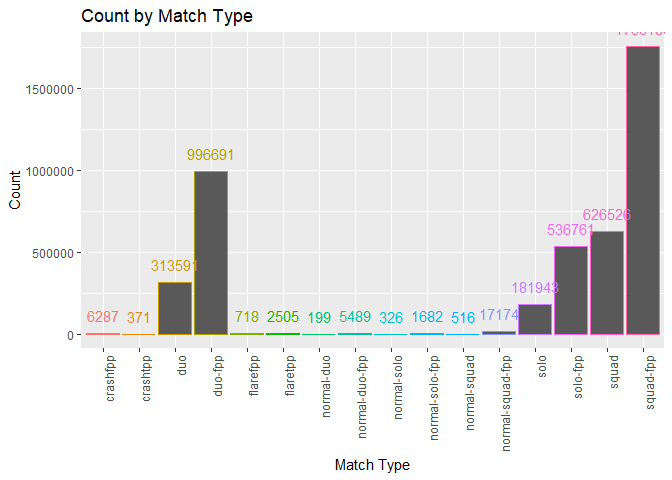
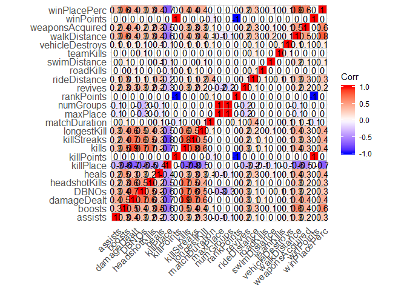
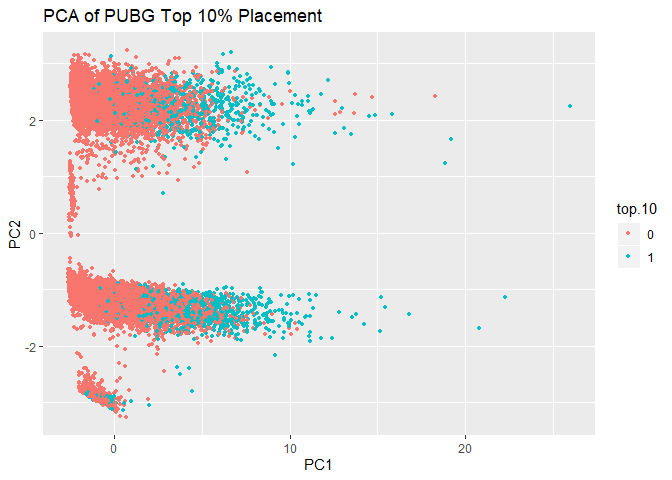

Exploratory Data Analysis
================
Chance Robinson
11/2/2019

  - [Exploratory Data Analysis](#exploratory-data-analysis)
      - [Library Imports](#library-imports)
      - [Load the CSV Data](#load-the-csv-data)
      - [Default Output](#default-output)
          - [Data Dictionary](#data-dictionary)
          - [Identify Dimensions](#identify-dimensions)
          - [Train Columns](#train-columns)
          - [Describe the Data Types](#describe-the-data-types)
          - [Numeric Columns](#numeric-columns)
          - [Non-Numeric Columns](#non-numeric-columns)
      - [Correlation Matrix](#correlation-matrix)
          - [Accuracy](#accuracy)
          - [Sensitivity](#sensitivity)
          - [Specificity](#specificity)
          - [Precision](#precision)

# Exploratory Data Analysis

## Library Imports

``` r
library(tidyverse)
```

    ## -- Attaching packages ------------------------------------------------------------------------------- tidyverse 1.2.1 --

    ## v ggplot2 3.2.1     v purrr   0.3.3
    ## v tibble  2.1.3     v dplyr   0.8.3
    ## v tidyr   1.0.0     v stringr 1.4.0
    ## v readr   1.3.1     v forcats 0.4.0

    ## -- Conflicts ---------------------------------------------------------------------------------- tidyverse_conflicts() --
    ## x dplyr::filter() masks stats::filter()
    ## x dplyr::lag()    masks stats::lag()

``` r
library(knitr)
library(kableExtra)
```

    ## 
    ## Attaching package: 'kableExtra'

    ## The following object is masked from 'package:dplyr':
    ## 
    ##     group_rows

``` r
# Correlation Matrix
library(ggcorrplot)
library(Hmisc)
```

    ## Loading required package: lattice

    ## Loading required package: survival

    ## Loading required package: Formula

    ## 
    ## Attaching package: 'Hmisc'

    ## The following objects are masked from 'package:dplyr':
    ## 
    ##     src, summarize

    ## The following objects are masked from 'package:base':
    ## 
    ##     format.pval, units

``` r
# Downsampling
library(caret)
```

    ## 
    ## Attaching package: 'caret'

    ## The following object is masked from 'package:survival':
    ## 
    ##     cluster

    ## The following object is masked from 'package:purrr':
    ## 
    ##     lift

## Load the CSV Data

``` r
train <- read.csv("../../../../data/train_V2.csv", stringsAsFactors=FALSE)
test <- read.csv("../../../../data/test_V2.csv", stringsAsFactors=FALSE)
```

``` r
train.mod <- train

train.mod <- train.mod %>%
  filter(matchType %in% c("solo")) %>%
  mutate(top.10 = ifelse(winPlacePerc>.9, 1, 0)) %>%
  mutate(top.10 = as.factor(top.10))


set.seed(1234)
train.indices <- createDataPartition(y = train.mod$top.10,p = 0.7,list = FALSE)
train.full <- train.mod[train.indices,]
test.full <- train.mod[-train.indices,]


train.downsampled <- downSample(train.full, train.full$top.10)
train.downsampled$Class <- NULL

head(train.downsampled)
```

    ##               Id        groupId        matchId assists boosts damageDealt DBNOs
    ## 1 db007df1c6bfd9 ae6ca6bbf92290 8dabaf5de9df74       0      1      187.00     0
    ## 2 c0f3615e6e4e92 cb4921b5fbe9e7 c88eed3eaba0ad       0      0        0.00     0
    ## 3 023c75b5a33d28 d36487e186fa3e ea32449c1b0148       0      0      100.00     0
    ## 4 2639baa809a010 dc0c08ecec34ab 3bfd8d66edbeff       0      0       39.97     0
    ## 5 181789de38c30e 2e0aec37cf64dd a5ded0e832c843       0      2        0.00     0
    ## 6 955a39464c8201 810bd094a3f820 8618c1a40cb5b2       0      2      100.00     0
    ##   headshotKills heals killPlace killPoints kills killStreaks longestKill
    ## 1             0     0        12          0     2           1      31.630
    ## 2             0     0        91          0     0           0       0.000
    ## 3             1     0        32       1003     1           1      54.990
    ## 4             0     0        75          0     0           0       0.000
    ## 5             0     3        44          0     0           0       0.000
    ## 6             0     0        35          0     1           1       4.357
    ##   matchDuration matchType maxPlace numGroups rankPoints revives rideDistance
    ## 1          1352      solo       96        91       1500       0            0
    ## 2          1427      solo       94        93       1504       0            0
    ## 3          1470      solo       97        93         -1       0            0
    ## 4          1928      solo       99        95       1497       0            0
    ## 5          1979      solo       96        89       1562       0         1151
    ## 6          1882      solo       97        93       1521       0            0
    ##   roadKills swimDistance teamKills vehicleDestroys walkDistance weaponsAcquired
    ## 1         0         0.00         0               0       2519.0               4
    ## 2         0         0.00         0               0          0.0               0
    ## 3         0         0.00         0               0        115.0               2
    ## 4         0         0.00         0               0        108.1               3
    ## 5         0        43.94         0               0       2955.0               6
    ## 6         0         0.00         1               0       1491.0               1
    ##   winPoints winPlacePerc top.10
    ## 1         0       0.8737      0
    ## 2         0       0.0323      0
    ## 3      1485       0.3958      0
    ## 4         0       0.2653      0
    ## 5         0       0.8105      0
    ## 6         0       0.4271      0

``` r
dim(train.mod)
```

    ## [1] 181943     30

``` r
dim(train.full)
```

    ## [1] 127361     30

``` r
dim(test.full)
```

    ## [1] 54582    30

``` r
dim(train.downsampled)
```

    ## [1] 26614    30

``` r
# write.csv(train.mod, "C:\\Users\\Chance\\pubg_solo_game_types.csv", row.names=FALSE)
# write.csv(train.full, "C:\\Users\\Chance\\pubg_solo_game_types_train_full.csv", row.names=FALSE)
# write.csv(train.downsampled, "C:\\Users\\Chance\\pubg_solo_game_types_train_downsampled.csv", row.names=FALSE)
# write.csv(test.full, "C:\\Users\\Chance\\pubg_solo_game_types_test_full.csv", row.names=FALSE)
```

## Default Output

### Data Dictionary

| Column Name     | Type      | Description                                                                                                                                       |
| --------------- | --------- | ------------------------------------------------------------------------------------------------------------------------------------------------- |
| DBNOs           | Integer   | Number of enemy players knocked.                                                                                                                  |
| assists         | Integer   | Number of enemy players this player damaged that were killed by teammates.                                                                        |
| boosts          | Integer   | Number of boost items used.                                                                                                                       |
| damageDealt     | Float     | Total damage dealt. Note: Self inflicted damage is subtracted.                                                                                    |
| headshotKills   | Integer   | Number of enemy players killed with headshots.                                                                                                    |
| heals           | Integer   | Number of healing items used.                                                                                                                     |
| Id              | Character | Player’s Id                                                                                                                                       |
| killPlace       | Integer   | Ranking in match of number of enemy players killed.                                                                                               |
| killPoints      | Integer   | Kills-based external ranking of player.                                                                                                           |
| killStreaks     | Integer   | Max number of enemy players killed in a short amount of time.                                                                                     |
| kills           | Integer   | Number of enemy players killed.                                                                                                                   |
| longestKill     | Float     | Longest distance between player and player killed at time of death.                                                                               |
| matchDuration   | Integer   | Duration of match in seconds.                                                                                                                     |
| matchId         | Character | ID to identify match. There are no matches that are in both the training and testing set.                                                         |
| matchType       | Character | String identifying the game mode that the data comes from.                                                                                        |
| rankPoints      | Integer   | Elo-like ranking of player.                                                                                                                       |
| revives         | Integer   | Number of times this player revived teammates.                                                                                                    |
| rideDistance    | Float     | Total distance traveled in vehicles measured in meters.                                                                                           |
| roadKills       | Integer   | Number of kills while in a vehicle.                                                                                                               |
| swimDistance    | Float     | Total distance traveled by swimming measured in meters.                                                                                           |
| teamKills       | Integer   | Number of times this player killed a teammate.                                                                                                    |
| vehicleDestroys | Integer   | Number of vehicles destroyed.                                                                                                                     |
| walkDistance    | Float     | Total distance traveled on foot measured in meters.                                                                                               |
| weaponsAcquired | Integer   | Number of weapons picked up.                                                                                                                      |
| winPoints       | Integer   | Win-based external ranking of player.                                                                                                             |
| groupId         | Character | ID to identify a group within a match. If the same group of players plays in different matches, they will have a different groupId each time.     |
| numGroups       | Integer   | Number of groups we have data for in the match.                                                                                                   |
| maxPlace        | Integer   | Worst placement we have data for in the match. This may not match with numGroups, as sometimes the data skips over placements.                    |
| winPlacePerc    | Float     | The target of prediction. This is a percentile winning placement, where 1 corresponds to 1st place, and 0 corresponds to last place in the match. |

### Identify Dimensions

``` r
dim(train)
```

    ## [1] 4446966      29

### Train Columns

``` r
colnames(train)
```

    ##  [1] "Id"              "groupId"         "matchId"         "assists"        
    ##  [5] "boosts"          "damageDealt"     "DBNOs"           "headshotKills"  
    ##  [9] "heals"           "killPlace"       "killPoints"      "kills"          
    ## [13] "killStreaks"     "longestKill"     "matchDuration"   "matchType"      
    ## [17] "maxPlace"        "numGroups"       "rankPoints"      "revives"        
    ## [21] "rideDistance"    "roadKills"       "swimDistance"    "teamKills"      
    ## [25] "vehicleDestroys" "walkDistance"    "weaponsAcquired" "winPoints"      
    ## [29] "winPlacePerc"

``` r
head(train)
```

    ##               Id        groupId        matchId assists boosts damageDealt DBNOs
    ## 1 7f96b2f878858a 4d4b580de459be a10357fd1a4a91       0      0        0.00     0
    ## 2 eef90569b9d03c 684d5656442f9e aeb375fc57110c       0      0       91.47     0
    ## 3 1eaf90ac73de72 6a4a42c3245a74 110163d8bb94ae       1      0       68.00     0
    ## 4 4616d365dd2853 a930a9c79cd721 f1f1f4ef412d7e       0      0       32.90     0
    ## 5 315c96c26c9aac de04010b3458dd 6dc8ff871e21e6       0      0      100.00     0
    ## 6 ff79c12f326506 289a6836a88d27 bac52627a12114       0      0      100.00     1
    ##   headshotKills heals killPlace killPoints kills killStreaks longestKill
    ## 1             0     0        60       1241     0           0        0.00
    ## 2             0     0        57          0     0           0        0.00
    ## 3             0     0        47          0     0           0        0.00
    ## 4             0     0        75          0     0           0        0.00
    ## 5             0     0        45          0     1           1       58.53
    ## 6             1     0        44          0     1           1       18.44
    ##   matchDuration matchType maxPlace numGroups rankPoints revives rideDistance
    ## 1          1306 squad-fpp       28        26         -1       0       0.0000
    ## 2          1777 squad-fpp       26        25       1484       0       0.0045
    ## 3          1318       duo       50        47       1491       0       0.0000
    ## 4          1436 squad-fpp       31        30       1408       0       0.0000
    ## 5          1424  solo-fpp       97        95       1560       0       0.0000
    ## 6          1395 squad-fpp       28        28       1418       0       0.0000
    ##   roadKills swimDistance teamKills vehicleDestroys walkDistance weaponsAcquired
    ## 1         0         0.00         0               0       244.80               1
    ## 2         0        11.04         0               0      1434.00               5
    ## 3         0         0.00         0               0       161.80               2
    ## 4         0         0.00         0               0       202.70               3
    ## 5         0         0.00         0               0        49.75               2
    ## 6         0         0.00         0               0        34.70               1
    ##   winPoints winPlacePerc
    ## 1      1466       0.4444
    ## 2         0       0.6400
    ## 3         0       0.7755
    ## 4         0       0.1667
    ## 5         0       0.1875
    ## 6         0       0.0370

``` r
# summary(train)
# str(train)
# dim(train)
```

``` r
head(test)
```

    ##               Id        groupId        matchId assists boosts damageDealt DBNOs
    ## 1 9329eb41e215eb 676b23c24e70d6 45b576ab7daa7f       0      0       51.46     0
    ## 2 639bd0dcd7bda8 430933124148dd 42a9a0b906c928       0      4      179.10     0
    ## 3 63d5c8ef8dfe91 0b45f5db20ba99 87e7e4477a048e       1      0       23.40     0
    ## 4 cf5b81422591d1 b7497dbdc77f4a 1b9a94f1af67f1       0      0       65.52     0
    ## 5 ee6a295187ba21 6604ce20a1d230 40754a93016066       0      4      330.20     1
    ## 6 3e2539b5d78183 029b5a79e08cd6 10186f5c852f62       0      0        0.00     0
    ##   headshotKills heals killPlace killPoints kills killStreaks longestKill
    ## 1             0     0        73          0     0           0        0.00
    ## 2             0     2        11          0     2           1      361.90
    ## 3             0     4        49          0     0           0        0.00
    ## 4             0     0        54          0     0           0        0.00
    ## 5             2     1         7          0     3           1       60.06
    ## 6             0     0        89          0     0           0        0.00
    ##   matchDuration matchType maxPlace numGroups rankPoints revives rideDistance
    ## 1          1884 squad-fpp       28        28       1500       0            0
    ## 2          1811   duo-fpp       48        47       1503       2         4669
    ## 3          1793 squad-fpp       28        27       1565       0            0
    ## 4          1834   duo-fpp       45        44       1465       0            0
    ## 5          1326 squad-fpp       28        27       1480       1            0
    ## 6          1775 squad-fpp       29        29       1490       0            0
    ##   roadKills swimDistance teamKills vehicleDestroys walkDistance weaponsAcquired
    ## 1         0            0         0               0        588.0               1
    ## 2         0            0         0               0       2017.0               6
    ## 3         0            0         0               0        787.8               4
    ## 4         0            0         0               0       1812.0               3
    ## 5         0            0         0               0       2963.0               4
    ## 6         0            0         0               0          0.0               0
    ##   winPoints
    ## 1         0
    ## 2         0
    ## 3         0
    ## 4         0
    ## 5         0
    ## 6         0

``` r
# summary(test)
# str(test)
# dim(test)
```

### Describe the Data Types

``` r
str(train)
```

    ## 'data.frame':    4446966 obs. of  29 variables:
    ##  $ Id             : chr  "7f96b2f878858a" "eef90569b9d03c" "1eaf90ac73de72" "4616d365dd2853" ...
    ##  $ groupId        : chr  "4d4b580de459be" "684d5656442f9e" "6a4a42c3245a74" "a930a9c79cd721" ...
    ##  $ matchId        : chr  "a10357fd1a4a91" "aeb375fc57110c" "110163d8bb94ae" "f1f1f4ef412d7e" ...
    ##  $ assists        : int  0 0 1 0 0 0 0 0 0 0 ...
    ##  $ boosts         : int  0 0 0 0 0 0 0 0 0 0 ...
    ##  $ damageDealt    : num  0 91.5 68 32.9 100 ...
    ##  $ DBNOs          : int  0 0 0 0 0 1 0 0 0 0 ...
    ##  $ headshotKills  : int  0 0 0 0 0 1 0 0 0 0 ...
    ##  $ heals          : int  0 0 0 0 0 0 0 0 0 0 ...
    ##  $ killPlace      : int  60 57 47 75 45 44 96 48 64 74 ...
    ##  $ killPoints     : int  1241 0 0 0 0 0 1262 1000 0 0 ...
    ##  $ kills          : int  0 0 0 0 1 1 0 0 0 0 ...
    ##  $ killStreaks    : int  0 0 0 0 1 1 0 0 0 0 ...
    ##  $ longestKill    : num  0 0 0 0 58.5 ...
    ##  $ matchDuration  : int  1306 1777 1318 1436 1424 1395 1316 1967 1375 1930 ...
    ##  $ matchType      : chr  "squad-fpp" "squad-fpp" "duo" "squad-fpp" ...
    ##  $ maxPlace       : int  28 26 50 31 97 28 28 96 28 29 ...
    ##  $ numGroups      : int  26 25 47 30 95 28 28 92 27 27 ...
    ##  $ rankPoints     : int  -1 1484 1491 1408 1560 1418 -1 -1 1493 1349 ...
    ##  $ revives        : int  0 0 0 0 0 0 0 0 0 0 ...
    ##  $ rideDistance   : num  0 0.0045 0 0 0 ...
    ##  $ roadKills      : int  0 0 0 0 0 0 0 0 0 0 ...
    ##  $ swimDistance   : num  0 11 0 0 0 ...
    ##  $ teamKills      : int  0 0 0 0 0 0 0 0 0 0 ...
    ##  $ vehicleDestroys: int  0 0 0 0 0 0 0 0 0 0 ...
    ##  $ walkDistance   : num  244.8 1434 161.8 202.7 49.8 ...
    ##  $ weaponsAcquired: int  1 5 2 3 2 1 1 6 4 1 ...
    ##  $ winPoints      : int  1466 0 0 0 0 0 1497 1500 0 0 ...
    ##  $ winPlacePerc   : num  0.444 0.64 0.775 0.167 0.188 ...

#### Missing Values

``` r
df_na_winPlacePerc <- train %>%
  filter(is.na(winPlacePerc)) 

df_na_winPlacePerc
```

    ##               Id        groupId        matchId assists boosts damageDealt DBNOs
    ## 1 f70c74418bb064 12dfbede33f92b 224a123c53e008       0      0           0     0
    ##   headshotKills heals killPlace killPoints kills killStreaks longestKill
    ## 1             0     0         1          0     0           0           0
    ##   matchDuration matchType maxPlace numGroups rankPoints revives rideDistance
    ## 1             9  solo-fpp        1         1       1574       0            0
    ##   roadKills swimDistance teamKills vehicleDestroys walkDistance weaponsAcquired
    ## 1         0            0         0               0            0               0
    ##   winPoints winPlacePerc
    ## 1         0           NA

``` r
# remove the row with no winPlacePerc   
train <- train[!train$Id == 'f70c74418bb064',]
```

### Numeric Columns

#### Column Names

``` r
train.numeric <- train %>%
  select_if(is.numeric)

colnames(train.numeric)
```

    ##  [1] "assists"         "boosts"          "damageDealt"     "DBNOs"          
    ##  [5] "headshotKills"   "heals"           "killPlace"       "killPoints"     
    ##  [9] "kills"           "killStreaks"     "longestKill"     "matchDuration"  
    ## [13] "maxPlace"        "numGroups"       "rankPoints"      "revives"        
    ## [17] "rideDistance"    "roadKills"       "swimDistance"    "teamKills"      
    ## [21] "vehicleDestroys" "walkDistance"    "weaponsAcquired" "winPoints"      
    ## [25] "winPlacePerc"

#### Summary Tables

``` r
summary(train.numeric)
```

    ##     assists            boosts        damageDealt          DBNOs        
    ##  Min.   : 0.0000   Min.   : 0.000   Min.   :   0.00   Min.   : 0.0000  
    ##  1st Qu.: 0.0000   1st Qu.: 0.000   1st Qu.:   0.00   1st Qu.: 0.0000  
    ##  Median : 0.0000   Median : 0.000   Median :  84.24   Median : 0.0000  
    ##  Mean   : 0.2338   Mean   : 1.107   Mean   : 130.72   Mean   : 0.6579  
    ##  3rd Qu.: 0.0000   3rd Qu.: 2.000   3rd Qu.: 186.00   3rd Qu.: 1.0000  
    ##  Max.   :22.0000   Max.   :33.000   Max.   :6616.00   Max.   :53.0000  
    ##  headshotKills         heals         killPlace       killPoints  
    ##  Min.   : 0.0000   Min.   : 0.00   Min.   :  1.0   Min.   :   0  
    ##  1st Qu.: 0.0000   1st Qu.: 0.00   1st Qu.: 24.0   1st Qu.:   0  
    ##  Median : 0.0000   Median : 0.00   Median : 47.0   Median :   0  
    ##  Mean   : 0.2268   Mean   : 1.37   Mean   : 47.6   Mean   : 505  
    ##  3rd Qu.: 0.0000   3rd Qu.: 2.00   3rd Qu.: 71.0   3rd Qu.:1172  
    ##  Max.   :64.0000   Max.   :80.00   Max.   :101.0   Max.   :2170  
    ##      kills          killStreaks      longestKill      matchDuration 
    ##  Min.   : 0.0000   Min.   : 0.000   Min.   :   0.00   Min.   : 133  
    ##  1st Qu.: 0.0000   1st Qu.: 0.000   1st Qu.:   0.00   1st Qu.:1367  
    ##  Median : 0.0000   Median : 0.000   Median :   0.00   Median :1438  
    ##  Mean   : 0.9248   Mean   : 0.544   Mean   :  23.00   Mean   :1580  
    ##  3rd Qu.: 1.0000   3rd Qu.: 1.000   3rd Qu.:  21.32   3rd Qu.:1851  
    ##  Max.   :72.0000   Max.   :20.000   Max.   :1094.00   Max.   :2237  
    ##     maxPlace       numGroups        rankPoints      revives       
    ##  Min.   :  2.0   Min.   :  1.00   Min.   :  -1   Min.   : 0.0000  
    ##  1st Qu.: 28.0   1st Qu.: 27.00   1st Qu.:  -1   1st Qu.: 0.0000  
    ##  Median : 30.0   Median : 30.00   Median :1443   Median : 0.0000  
    ##  Mean   : 44.5   Mean   : 43.01   Mean   : 892   Mean   : 0.1647  
    ##  3rd Qu.: 49.0   3rd Qu.: 47.00   3rd Qu.:1500   3rd Qu.: 0.0000  
    ##  Max.   :100.0   Max.   :100.00   Max.   :5910   Max.   :39.0000  
    ##   rideDistance        roadKills          swimDistance        teamKills       
    ##  Min.   :    0.00   Min.   : 0.000000   Min.   :   0.000   Min.   : 0.00000  
    ##  1st Qu.:    0.00   1st Qu.: 0.000000   1st Qu.:   0.000   1st Qu.: 0.00000  
    ##  Median :    0.00   Median : 0.000000   Median :   0.000   Median : 0.00000  
    ##  Mean   :  606.12   Mean   : 0.003496   Mean   :   4.509   Mean   : 0.02387  
    ##  3rd Qu.:    0.19   3rd Qu.: 0.000000   3rd Qu.:   0.000   3rd Qu.: 0.00000  
    ##  Max.   :40710.00   Max.   :18.000000   Max.   :3823.000   Max.   :12.00000  
    ##  vehicleDestroys     walkDistance     weaponsAcquired    winPoints     
    ##  Min.   :0.000000   Min.   :    0.0   Min.   :  0.00   Min.   :   0.0  
    ##  1st Qu.:0.000000   1st Qu.:  155.1   1st Qu.:  2.00   1st Qu.:   0.0  
    ##  Median :0.000000   Median :  685.6   Median :  3.00   Median :   0.0  
    ##  Mean   :0.007918   Mean   : 1154.2   Mean   :  3.66   Mean   : 606.5  
    ##  3rd Qu.:0.000000   3rd Qu.: 1976.0   3rd Qu.:  5.00   3rd Qu.:1495.0  
    ##  Max.   :5.000000   Max.   :25780.0   Max.   :236.00   Max.   :2013.0  
    ##   winPlacePerc   
    ##  Min.   :0.0000  
    ##  1st Qu.:0.2000  
    ##  Median :0.4583  
    ##  Mean   :0.4728  
    ##  3rd Qu.:0.7407  
    ##  Max.   :1.0000

### Non-Numeric Columns

#### Column Names

``` r
train.non.numeric <- train %>%
  select_if(is.character)

colnames(train.non.numeric)
```

    ## [1] "Id"        "groupId"   "matchId"   "matchType"

#### Count by Match Type

  - FPP - First Person Perspective
  - TPP - Third Peron Perspective

<!-- end list -->

``` r
train.non.numeric %>%
  group_by(matchType) %>%
  ggplot(aes(x = matchType, color=matchType)) + 
  geom_bar() +
  geom_text(stat='count', aes(label=..count..), vjust=-1) +
  ggtitle("Count by Match Type") +
  labs(x = "Match Type", y = "Count") +
  theme(axis.text.x = element_text(angle = 90, hjust = 1), legend.position = "none")
```

<!-- -->

## Correlation Matrix

``` r
# gc()

# memory.size(max = FALSE)
# memory.limit(size = NA)

corr <- round(cor(train.numeric), 1)
  
ggcorrplot(corr, method = "square", type = "full", lab = TRUE)
```

<!-- -->

\#\#\#Correlation matrix for quantitative data

``` r
# function for flattening and ordering the correlation matrix
flattenCorrMatrix <- function(cormat, pmat) {
  ut <- upper.tri(cormat)
  data.frame(
    row = rownames(cormat)[row(cormat)[ut]],
    column = rownames(cormat)[col(cormat)[ut]],
    cor  =(cormat)[ut],
    p = pmat[ut]
    )
}


# See what variables are correlated with each other, p-values
correlation.matrix <- rcorr(as.matrix(train.numeric))
corDF <- data.frame(flattenCorrMatrix(correlation.matrix$r, correlation.matrix$P))

# Order the correlation matrix to show the highest correlated
# data.frame(corDF[order(-corDF$cor),])
quantDataModel <- corDF[which(corDF$cor >= 0.4),]
data.frame(quantDataModel[order(-quantDataModel$cor),])
```

    ##                 row          column       cor p
    ## 91         maxPlace       numGroups 0.9978997 0
    ## 261      killPoints       winPoints 0.9834167 0
    ## 31      damageDealt           kills 0.8887834 0
    ## 298    walkDistance    winPlacePerc 0.8108875 0
    ## 45            kills     killStreaks 0.8025001 0
    ## 6       damageDealt           DBNOs 0.7357628 0
    ## 32            DBNOs           kills 0.7078479 0
    ## 39      damageDealt     killStreaks 0.7035994 0
    ## 33    headshotKills           kills 0.6742754 0
    ## 40            DBNOs     killStreaks 0.6468723 0
    ## 212          boosts    walkDistance 0.6401502 0
    ## 278          boosts    winPlacePerc 0.6342343 0
    ## 9       damageDealt   headshotKills 0.6134092 0
    ## 54            kills     longestKill 0.6029365 0
    ## 299 weaponsAcquired    winPlacePerc 0.5838062 0
    ## 48      damageDealt     longestKill 0.5638372 0
    ## 253    walkDistance weaponsAcquired 0.5412215 0
    ## 12           boosts           heals 0.5358539 0
    ## 3            boosts     damageDealt 0.5219474 0
    ## 55      killStreaks     longestKill 0.5150969 0
    ## 41    headshotKills     killStreaks 0.5128821 0
    ## 30           boosts           kills 0.5020236 0
    ## 10            DBNOs   headshotKills 0.4699230 0
    ## 49            DBNOs     longestKill 0.4514216 0
    ## 50    headshotKills     longestKill 0.4472607 0
    ## 279     damageDealt    winPlacePerc 0.4405068 0
    ## 216           heals    walkDistance 0.4302656 0
    ## 282           heals    winPlacePerc 0.4278570 0
    ## 47           boosts     longestKill 0.4232903 0
    ## 285           kills    winPlacePerc 0.4199160 0
    ## 221     longestKill    walkDistance 0.4138100 0
    ## 287     longestKill    winPlacePerc 0.4101536 0
    ## 2           assists     damageDealt 0.4067265 0
    ## 233          boosts weaponsAcquired 0.4066089 0
    ## 38           boosts     killStreaks 0.4053269 0

``` r
train.downsampled <- train.downsampled %>%
  mutate(top.10 = factor(top.10, labels = c("No", "Yes")))

head(train.downsampled)
```

    ##               Id        groupId        matchId assists boosts damageDealt DBNOs
    ## 1 db007df1c6bfd9 ae6ca6bbf92290 8dabaf5de9df74       0      1      187.00     0
    ## 2 c0f3615e6e4e92 cb4921b5fbe9e7 c88eed3eaba0ad       0      0        0.00     0
    ## 3 023c75b5a33d28 d36487e186fa3e ea32449c1b0148       0      0      100.00     0
    ## 4 2639baa809a010 dc0c08ecec34ab 3bfd8d66edbeff       0      0       39.97     0
    ## 5 181789de38c30e 2e0aec37cf64dd a5ded0e832c843       0      2        0.00     0
    ## 6 955a39464c8201 810bd094a3f820 8618c1a40cb5b2       0      2      100.00     0
    ##   headshotKills heals killPlace killPoints kills killStreaks longestKill
    ## 1             0     0        12          0     2           1      31.630
    ## 2             0     0        91          0     0           0       0.000
    ## 3             1     0        32       1003     1           1      54.990
    ## 4             0     0        75          0     0           0       0.000
    ## 5             0     3        44          0     0           0       0.000
    ## 6             0     0        35          0     1           1       4.357
    ##   matchDuration matchType maxPlace numGroups rankPoints revives rideDistance
    ## 1          1352      solo       96        91       1500       0            0
    ## 2          1427      solo       94        93       1504       0            0
    ## 3          1470      solo       97        93         -1       0            0
    ## 4          1928      solo       99        95       1497       0            0
    ## 5          1979      solo       96        89       1562       0         1151
    ## 6          1882      solo       97        93       1521       0            0
    ##   roadKills swimDistance teamKills vehicleDestroys walkDistance weaponsAcquired
    ## 1         0         0.00         0               0       2519.0               4
    ## 2         0         0.00         0               0          0.0               0
    ## 3         0         0.00         0               0        115.0               2
    ## 4         0         0.00         0               0        108.1               3
    ## 5         0        43.94         0               0       2955.0               6
    ## 6         0         0.00         1               0       1491.0               1
    ##   winPoints winPlacePerc top.10
    ## 1         0       0.8737     No
    ## 2         0       0.0323     No
    ## 3      1485       0.3958     No
    ## 4         0       0.2653     No
    ## 5         0       0.8105     No
    ## 6         0       0.4271     No

``` r
dim(train.downsampled)
```

    ## [1] 26614    30

``` r
table(train.downsampled$top.10)
```

    ## 
    ##    No   Yes 
    ## 13307 13307

``` r
summary(train.downsampled)
```

    ##       Id              groupId            matchId             assists      
    ##  Length:26614       Length:26614       Length:26614       Min.   :0.0000  
    ##  Class :character   Class :character   Class :character   1st Qu.:0.0000  
    ##  Mode  :character   Mode  :character   Mode  :character   Median :0.0000  
    ##                                                           Mean   :0.1107  
    ##                                                           3rd Qu.:0.0000  
    ##                                                           Max.   :4.0000  
    ##      boosts        damageDealt          DBNOs   headshotKills    
    ##  Min.   : 0.000   Min.   :   0.00   Min.   :0   Min.   : 0.0000  
    ##  1st Qu.: 0.000   1st Qu.:  19.35   1st Qu.:0   1st Qu.: 0.0000  
    ##  Median : 1.000   Median : 121.05   Median :0   Median : 0.0000  
    ##  Mean   : 2.331   Mean   : 204.71   Mean   :0   Mean   : 0.4858  
    ##  3rd Qu.: 4.000   3rd Qu.: 300.00   3rd Qu.:0   3rd Qu.: 1.0000  
    ##  Max.   :19.000   Max.   :2490.00   Max.   :0   Max.   :15.0000  
    ##      heals          killPlace        killPoints         kills       
    ##  Min.   : 0.000   Min.   :  1.00   Min.   :   0.0   Min.   : 0.000  
    ##  1st Qu.: 0.000   1st Qu.:  7.00   1st Qu.:   0.0   1st Qu.: 0.000  
    ##  Median : 1.000   Median : 22.00   Median :   0.0   Median : 1.000  
    ##  Mean   : 1.786   Mean   : 31.84   Mean   : 415.9   Mean   : 1.754  
    ##  3rd Qu.: 2.000   3rd Qu.: 51.00   3rd Qu.:1051.8   3rd Qu.: 3.000  
    ##  Max.   :39.000   Max.   :100.00   Max.   :1913.0   Max.   :21.000  
    ##   killStreaks       longestKill       matchDuration   matchType        
    ##  Min.   : 0.0000   Min.   :   0.000   Min.   : 950   Length:26614      
    ##  1st Qu.: 0.0000   1st Qu.:   0.000   1st Qu.:1433   Class :character  
    ##  Median : 1.0000   Median :   8.544   Median :1788   Mode  :character  
    ##  Mean   : 0.6439   Mean   :  42.887   Mean   :1681                     
    ##  3rd Qu.: 1.0000   3rd Qu.:  59.950   3rd Qu.:1904                     
    ##  Max.   :16.0000   Max.   :1001.000   Max.   :2237                     
    ##     maxPlace        numGroups       rankPoints        revives   rideDistance  
    ##  Min.   : 11.00   Min.   : 1.00   Min.   :  -1.0   Min.   :0   Min.   :    0  
    ##  1st Qu.: 93.00   1st Qu.:89.00   1st Qu.:  -1.0   1st Qu.:0   1st Qu.:    0  
    ##  Median : 96.00   Median :92.00   Median :1499.0   Median :0   Median :    0  
    ##  Mean   : 91.05   Mean   :86.95   Mean   : 993.4   Mean   :0   Mean   : 1091  
    ##  3rd Qu.: 97.00   3rd Qu.:94.00   3rd Qu.:1520.0   3rd Qu.:0   3rd Qu.: 1364  
    ##  Max.   :100.00   Max.   :99.00   Max.   :2754.0   Max.   :0   Max.   :26600  
    ##    roadKills         swimDistance       teamKills        vehicleDestroys  
    ##  Min.   : 0.00000   Min.   :   0.00   Min.   :0.000000   Min.   :0.00000  
    ##  1st Qu.: 0.00000   1st Qu.:   0.00   1st Qu.:0.000000   1st Qu.:0.00000  
    ##  Median : 0.00000   Median :   0.00   Median :0.000000   Median :0.00000  
    ##  Mean   : 0.01743   Mean   :  10.75   Mean   :0.009957   Mean   :0.01443  
    ##  3rd Qu.: 0.00000   3rd Qu.:   0.00   3rd Qu.:0.000000   3rd Qu.:0.00000  
    ##  Max.   :11.00000   Max.   :1321.00   Max.   :1.000000   Max.   :3.00000  
    ##   walkDistance     weaponsAcquired    winPoints       winPlacePerc   
    ##  Min.   :    0.0   Min.   : 0.000   Min.   :   0.0   Min.   :0.0000  
    ##  1st Qu.:  344.9   1st Qu.: 3.000   1st Qu.:   0.0   1st Qu.:0.4062  
    ##  Median : 1565.0   Median : 4.000   Median :   0.0   Median :0.9005  
    ##  Mean   : 1587.7   Mean   : 4.614   Mean   : 538.1   Mean   :0.6845  
    ##  3rd Qu.: 2477.0   3rd Qu.: 6.000   3rd Qu.:1499.0   3rd Qu.:0.9574  
    ##  Max.   :11830.0   Max.   :52.000   Max.   :1892.0   Max.   :1.0000  
    ##  top.10     
    ##  No :13307  
    ##  Yes:13307  
    ##             
    ##             
    ##             
    ## 

``` r
model <- glm(top.10 ~ walkDistance+killPlace+boosts+weaponsAcquired+damageDealt+heals+kills, data = train.downsampled, family = binomial("logit"))
summary(model)
```

    ## 
    ## Call:
    ## glm(formula = top.10 ~ walkDistance + killPlace + boosts + weaponsAcquired + 
    ##     damageDealt + heals + kills, family = binomial("logit"), 
    ##     data = train.downsampled)
    ## 
    ## Deviance Residuals: 
    ##     Min       1Q   Median       3Q      Max  
    ## -3.3768  -0.3294  -0.0052   0.5001   2.6778  
    ## 
    ## Coefficients:
    ##                   Estimate Std. Error z value Pr(>|z|)    
    ## (Intercept)     -1.084e-01  6.935e-02  -1.563    0.118    
    ## walkDistance     8.366e-04  2.195e-05  38.111  < 2e-16 ***
    ## killPlace       -7.685e-02  1.564e-03 -49.142  < 2e-16 ***
    ## boosts           3.638e-01  1.212e-02  30.021  < 2e-16 ***
    ## weaponsAcquired  6.601e-02  7.928e-03   8.327  < 2e-16 ***
    ## damageDealt      1.487e-03  2.591e-04   5.737 9.65e-09 ***
    ## heals           -2.702e-02  6.519e-03  -4.145 3.40e-05 ***
    ## kills           -3.697e-01  2.668e-02 -13.856  < 2e-16 ***
    ## ---
    ## Signif. codes:  0 '***' 0.001 '**' 0.01 '*' 0.05 '.' 0.1 ' ' 1
    ## 
    ## (Dispersion parameter for binomial family taken to be 1)
    ## 
    ##     Null deviance: 36895  on 26613  degrees of freedom
    ## Residual deviance: 17111  on 26606  degrees of freedom
    ## AIC: 17127
    ## 
    ## Number of Fisher Scoring iterations: 6

``` r
# confint(model) 
```

``` r
train.downsampled$predict <- as.factor(ifelse(model$fitted.values >0.5, "Yes", "No"))


mytable <- table(train.downsampled$top.10, train.downsampled$predict)
rownames(mytable) <- c("Obs (Bottom 90)", "Obs (Top 10)")
colnames(mytable) <- c("Pred (Bottom 90)", "Pred (Top 10)")
mytable
```

    ##                  
    ##                   Pred (Bottom 90) Pred (Top 10)
    ##   Obs (Bottom 90)            11070          2237
    ##   Obs (Top 10)                1480         11827

#### Accuracy

``` r
# Overall performance of our prediction model
accuracy <- sum(diag(mytable))/sum(mytable)
accuracy
```

    ## [1] 0.8603367

``` r
tn <- mytable[1,1]
fn <- mytable[2,1]
fp <- mytable[1,2]
tp <- mytable[2,2]

rtotal.0 <- sum(mytable[1,])
rtotal.1 <- sum(mytable[2,])
ctotal.0 <- sum(mytable[,1])
ctotal.1 <- sum(mytable[,2])
total <- sum(mytable)


tn
```

    ## [1] 11070

``` r
fn
```

    ## [1] 1480

``` r
fp
```

    ## [1] 2237

``` r
tp
```

    ## [1] 11827

#### Sensitivity

  - When it was in the top 10%, how often did we predict that it was?

<!-- end list -->

``` r
# True Positive Rate
sensitivity <- (tp) / (ctotal.1)
sensitivity
```

    ## [1] 0.8409414

#### Specificity

  - When it was in the bottom 90%, how often did we predict that it was?

<!-- end list -->

``` r
# True Negative Rate:
specificity <- (tn) / (rtotal.0)
specificity
```

    ## [1] 0.831893

#### Precision

  - When we predicted yes, how often is it correct?

<!-- end list -->

``` r
# True Negative Rate:
precision <- (tp) / (ctotal.1)
precision
```

    ## [1] 0.8409414

``` r
cols.to.remove <- c("DBNOs", "revives")

train.mod.numeric <- train.mod %>%
  filter(matchType %in% c("solo", "solo-fpp")) %>%
  select_if(is.numeric) %>%
  select(-cols.to.remove) %>%
  mutate(top.10 = ifelse(winPlacePerc>.9, 1, 0)) %>%
  mutate(matchDurationLength = ifelse(matchDuration >= mean(matchDuration), 1, 0))


head(train.mod.numeric)
```

    ##   assists boosts damageDealt headshotKills heals killPlace killPoints kills
    ## 1       0      1      100.00             0     0        24          0     1
    ## 2       0      0       17.81             0     0        79       1274     0
    ## 3       0      1      100.00             0     0        38       1000     1
    ## 4       0      0       36.00             0     0        84          0     0
    ## 5       0      1      236.00             0     7         7       1142     3
    ## 6       0      0        0.00             0     0        65          0     0
    ##   killStreaks longestKill matchDuration maxPlace numGroups rankPoints
    ## 1           1      21.250          1398       92        89       1509
    ## 2           0       0.000          1945       99        95         -1
    ## 3           1       7.667          2042       90        86         -1
    ## 4           0       0.000          1999       94        92       1507
    ## 5           1      11.720          1423       94        88         -1
    ## 6           0       0.000          1471       99        94       1500
    ##   rideDistance roadKills swimDistance teamKills vehicleDestroys walkDistance
    ## 1          0.0         0           61         0               0       1528.0
    ## 2        129.3         0            0         0               0        471.9
    ## 3          0.0         0            0         0               0        231.7
    ## 4          0.0         0            0         0               0        292.6
    ## 5          0.0         0            0         0               0       1913.0
    ## 6          0.0         0            0         0               0        870.9
    ##   weaponsAcquired winPoints winPlacePerc top.10 matchDurationLength
    ## 1               3         0       0.8462      0                   0
    ## 2               3      1536       0.2245      0                   1
    ## 3               4      1500       0.1573      0                   1
    ## 4               1         0       0.1075      0                   1
    ## 5               8      1557       0.9355      1                   0
    ## 6               3         0       0.3878      0                   0

``` r
# table(train.mod.numeric$revives)


pca.result <- prcomp(train.mod.numeric[1:22], scale.=TRUE)
# pca.result <- prcomp(train.mod.numeric[1:24])
pca.scores <- pca.result$x

head(pca.scores)
```

    ##              PC1        PC2        PC3         PC4        PC5        PC6
    ## [1,]  0.38682392 -1.0794062 -0.3183832 -0.79985456  1.0474064 -0.2438497
    ## [2,] -1.73501971  2.5039421 -0.1286761  0.64664334 -0.4011508  0.2995724
    ## [3,] -0.03427782  1.8833181  0.8439693  0.20848545 -0.5435661  0.5374249
    ## [4,] -2.13590855 -1.1302511 -0.8545561  0.04497042 -0.5106357  0.3101964
    ## [5,]  2.52460037  2.2075738  0.7848590  0.39581298  1.2066475 -0.1398577
    ## [6,] -1.69759482 -0.8998494 -0.9756869 -0.41299844  0.3495923 -0.1170731
    ##             PC7         PC8        PC9        PC10        PC11       PC12
    ## [1,] -1.4901892 -0.53935144 -0.1274908  0.04699999  0.51787748 -0.4478379
    ## [2,]  0.4557082  0.31019431 -0.7962651 -0.04940735 -0.02701182  0.7275551
    ## [3,]  0.1705238  0.53812278 -0.6985109 -0.18660796  0.42272898  0.9169934
    ## [4,]  0.5053955  0.02970506 -0.8711114  0.03152857 -0.54318129  0.7621315
    ## [5,] -0.6071806  0.60303360  1.8527193  0.35016644  0.13445623  0.6587371
    ## [6,] -0.1432508 -0.01529187  0.3900266  0.17506644  0.25035630 -0.2984875
    ##             PC13        PC14        PC15       PC16        PC17         PC18
    ## [1,] -0.65458144  0.67153489  0.22359630  0.4404752  0.15067911 -0.001294542
    ## [2,]  0.16105165 -0.17760359  0.02514251 -0.2820527 -0.03690238 -0.064449257
    ## [3,] -1.15367759  0.02456493  0.28860437 -0.5939853  0.61111113  0.002133732
    ## [4,]  0.05588533  0.08621191  0.24437221 -0.1813078 -0.06904241 -0.169572012
    ## [5,] -1.05912260 -0.66583938 -0.89168642 -0.0828924 -1.03617181  0.036092274
    ## [6,]  0.46279577  0.02040302 -0.06811990  0.2786110 -0.19077437  0.077626734
    ##              PC19         PC20        PC21         PC22
    ## [1,] -0.021803230  0.008727890 -0.01313175 -0.016292852
    ## [2,] -0.005276744 -0.185886096  0.04700198 -0.030757921
    ## [3,] -0.071256372  0.187748652 -0.08756661  0.094023453
    ## [4,]  0.046711548 -0.041645947 -0.07314810 -0.003567059
    ## [5,] -0.566206406  0.049823227  0.08785344  0.066060365
    ## [6,] -0.067947912  0.008887314  0.10045261 -0.016883355

``` r
# pairs(pca.scores)
# cor(pca.scores)
```

A scree plot of the eigenvalues used to determine how many pc’s to keep
can be plotted in the following way:

``` r
par(mfrow=c(1,2))
eigenvals <- (pca.result$sdev)^2
plot(1:22,eigenvals/sum(eigenvals), type="l", main="Scree Plot", ylab="Prop. Var. Explained")
cumulative.prop <- cumsum(eigenvals/sum(eigenvals))
plot(1:22,cumulative.prop, type="l", main="Cumulative proportion", ylim=c(0,1))
```

<!-- -->

``` r
par(mfrow=c(1,1))
```

``` r
#Getting a look at the distribution
table(train.mod.numeric$top.10)
```

    ## 
    ##      0      1 
    ## 162933  19010

``` r
#Adding the response column to the PC's data frame
pca.scores <- data.frame(pca.scores)
pca.scores$top.10 <- as.factor(train.mod.numeric$top.10)
pca.scores$matchDurationLength <- as.factor(train.mod.numeric$matchDurationLength)

table(train.mod.numeric$matchDurationLength)
```

    ## 
    ##     0     1 
    ## 87962 93981

``` r
# ggplot(data = pca.scores, aes(x = PC1, y = PC2)) +
#   geom_point(aes(col=top.10), size=1)+
#   ggtitle("PCA of PUBG Top 10%")
```

``` r
# , shape = matchDurationLength

plotPC <- function(mydata) {
  sampleData <- sample_frac(mydata, 0.10)
  ggplot(data = sampleData, aes(x = PC1, y = PC2)) +
    geom_point(aes(col=top.10), size=1)+
    ggtitle("PCA of PUBG Top 10% Placement")
}

set.seed(314159)
plotPC(pca.scores)
```

<!-- -->
