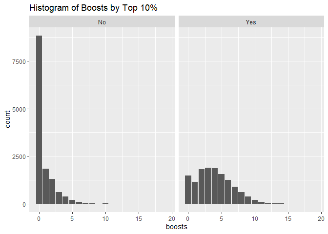

Exploratory Data Analysis
================
Chance Robinson
11/2/2019

  - [Exploratory Data Analysis](#exploratory-data-analysis)
      - [Library Imports](#library-imports)
      - [Load the CSV Data](#load-the-csv-data)
      - [Default Output](#default-output)
          - [Data Dictionary](#data-dictionary)
          - [Identify Dimensions](#identify-dimensions)
          - [Train Columns](#train-columns)
          - [Describe the Data Types](#describe-the-data-types)
          - [Numeric Columns](#numeric-columns)
          - [Non-Numeric Columns](#non-numeric-columns)
      - [Correlation Matrix](#correlation-matrix)
          - [Histogram of Assists (1)](#histogram-of-assists-1)
          - [Histogram of Boosts (2)](#histogram-of-boosts-2)
          - [Histogram of Damage Dealt
            (3)](#histogram-of-damage-dealt-3)
          - [Histogram of Head Shot Kills
            (4)](#histogram-of-head-shot-kills-4)
          - [Histogram of Heals (5)](#histogram-of-heals-5)
          - [Histogram of Kill Place (6)](#histogram-of-kill-place-6)
          - [Histogram of Kills (7)](#histogram-of-kills-7)
          - [Histogram of Kill Streaks
            (8)](#histogram-of-kill-streaks-8)
          - [Histogram of Longest Kill
            (9)](#histogram-of-longest-kill-9)
          - [Histogram of Match Duration
            (10)](#histogram-of-match-duration-10)
          - [Histogram of maxPlace (11)](#histogram-of-maxplace-11)
          - [Histogram of numGroups (12)](#histogram-of-numgroups-12)
          - [Histogram of Ride Distance
            (13)](#histogram-of-ride-distance-13)
          - [Histogram of weapons Acquired
            (14)](#histogram-of-weapons-acquired-14)

# Exploratory Data Analysis

## Library Imports

``` r
library(tidyverse)
```

    ## -- Attaching packages -------------------------------------------------------------------------------------------------------- tidyverse 1.2.1 --

    ## v ggplot2 3.2.1     v purrr   0.3.3
    ## v tibble  2.1.3     v dplyr   0.8.3
    ## v tidyr   1.0.0     v stringr 1.4.0
    ## v readr   1.3.1     v forcats 0.4.0

    ## -- Conflicts ----------------------------------------------------------------------------------------------------------- tidyverse_conflicts() --
    ## x dplyr::filter() masks stats::filter()
    ## x dplyr::lag()    masks stats::lag()

``` r
library(knitr)
library(kableExtra)
```

    ## 
    ## Attaching package: 'kableExtra'

    ## The following object is masked from 'package:dplyr':
    ## 
    ##     group_rows

``` r
# Correlation Matrix
library(ggcorrplot)
library(Hmisc)
```

    ## Loading required package: lattice

    ## Loading required package: survival

    ## Loading required package: Formula

    ## 
    ## Attaching package: 'Hmisc'

    ## The following objects are masked from 'package:dplyr':
    ## 
    ##     src, summarize

    ## The following objects are masked from 'package:base':
    ## 
    ##     format.pval, units

``` r
# Downsampling
library(caret)
```

    ## 
    ## Attaching package: 'caret'

    ## The following object is masked from 'package:survival':
    ## 
    ##     cluster

    ## The following object is masked from 'package:purrr':
    ## 
    ##     lift

## Load the CSV Data

``` r
data <- read.csv("../../../../data/pubg_solo_game_types.csv", stringsAsFactors=FALSE)
train.full <- read.csv("../../../../data/pubg_solo_game_types_train_full.csv", stringsAsFactors=FALSE)

train <- read.csv("../../../../data/pubg_solo_game_types_train_downsampled.csv", stringsAsFactors=FALSE)
test <- read.csv("../../../../data/pubg_solo_game_types_test_full.csv", stringsAsFactors=FALSE)
```

``` r
train.mod <- train
#
train.mod <- train.mod %>%
  filter(matchType %in% c("solo")) %>%
  mutate(top.10 = ifelse(winPlacePerc>.9, 1, 0)) 
  # mutate(top.10 = as.factor(top.10))


set.seed(1234)
train.indices <- createDataPartition(y = train.mod$top.10,p = 0.7,list = FALSE)
train.full <- train.mod[train.indices,]
test.full <- train.mod[-train.indices,]

# 
train.downsampled <- downSample(train.full, train.full$top.10)
```

    ## Warning in downSample(train.full, train.full$top.10): Down-sampling requires a
    ## factor variable as the response. The original data was returned.

``` r
train.downsampled$Class <- NULL

# head(train.downsampled)
#
# dim(train.mod)
# dim(train.full)
# dim(test.full)
# dim(train.downsampled)

# write.csv(train.mod, "C:\\Users\\Chance\\pubg_solo_game_types.csv", row.names=FALSE)
# write.csv(train.full, "C:\\Users\\Chance\\pubg_solo_game_types_train_full.csv", row.names=FALSE)
# write.csv(train.downsampled, "C:\\Users\\Chance\\pubg_solo_game_types_train_downsampled.csv", row.names=FALSE)
# write.csv(test.full, "C:\\Users\\Chance\\pubg_solo_game_types_test_full.csv", row.names=FALSE)
# # 

#data <- read.csv("../../../../data/pubg_solo_game_types.csv", stringsAsFactors=FALSE)
```

## Default Output

### Data Dictionary

| Column Name     | Type      | Description                                                                                                                                       |
| --------------- | --------- | ------------------------------------------------------------------------------------------------------------------------------------------------- |
| DBNOs           | Integer   | Number of enemy players knocked.                                                                                                                  |
| assists         | Integer   | Number of enemy players this player damaged that were killed by teammates.                                                                        |
| boosts          | Integer   | Number of boost items used.                                                                                                                       |
| damageDealt     | Float     | Total damage dealt. Note: Self inflicted damage is subtracted.                                                                                    |
| headshotKills   | Integer   | Number of enemy players killed with headshots.                                                                                                    |
| heals           | Integer   | Number of healing items used.                                                                                                                     |
| Id              | Character | Player’s Id                                                                                                                                       |
| killPlace       | Integer   | Ranking in match of number of enemy players killed.                                                                                               |
| killPoints      | Integer   | Kills-based external ranking of player.                                                                                                           |
| killStreaks     | Integer   | Max number of enemy players killed in a short amount of time.                                                                                     |
| kills           | Integer   | Number of enemy players killed.                                                                                                                   |
| longestKill     | Float     | Longest distance between player and player killed at time of death.                                                                               |
| matchDuration   | Integer   | Duration of match in seconds.                                                                                                                     |
| matchId         | Character | ID to identify match. There are no matches that are in both the training and testing set.                                                         |
| matchType       | Character | String identifying the game mode that the data comes from.                                                                                        |
| rankPoints      | Integer   | Elo-like ranking of player.                                                                                                                       |
| revives         | Integer   | Number of times this player revived teammates.                                                                                                    |
| rideDistance    | Float     | Total distance traveled in vehicles measured in meters.                                                                                           |
| roadKills       | Integer   | Number of kills while in a vehicle.                                                                                                               |
| swimDistance    | Float     | Total distance traveled by swimming measured in meters.                                                                                           |
| teamKills       | Integer   | Number of times this player killed a teammate.                                                                                                    |
| vehicleDestroys | Integer   | Number of vehicles destroyed.                                                                                                                     |
| walkDistance    | Float     | Total distance traveled on foot measured in meters.                                                                                               |
| weaponsAcquired | Integer   | Number of weapons picked up.                                                                                                                      |
| winPoints       | Integer   | Win-based external ranking of player.                                                                                                             |
| groupId         | Character | ID to identify a group within a match. If the same group of players plays in different matches, they will have a different groupId each time.     |
| numGroups       | Integer   | Number of groups we have data for in the match.                                                                                                   |
| maxPlace        | Integer   | Worst placement we have data for in the match. This may not match with numGroups, as sometimes the data skips over placements.                    |
| winPlacePerc    | Float     | The target of prediction. This is a percentile winning placement, where 1 corresponds to 1st place, and 0 corresponds to last place in the match. |

### Identify Dimensions

``` r
dim(data)
```

    ## [1] 181943     30

``` r
table(data$top.10)
```

    ## 
    ##      0      1 
    ## 162933  19010

``` r
dim(train.full)
```

    ## [1] 18630    30

``` r
# dim(train)
# 
# train[train$Id == '8d699d579f43e1']
```

``` r
dim(test)
```

    ## [1] 54582    30

### Train Columns

``` r
colnames(data)
```

    ##  [1] "Id"              "groupId"         "matchId"         "assists"        
    ##  [5] "boosts"          "damageDealt"     "DBNOs"           "headshotKills"  
    ##  [9] "heals"           "killPlace"       "killPoints"      "kills"          
    ## [13] "killStreaks"     "longestKill"     "matchDuration"   "matchType"      
    ## [17] "maxPlace"        "numGroups"       "rankPoints"      "revives"        
    ## [21] "rideDistance"    "roadKills"       "swimDistance"    "teamKills"      
    ## [25] "vehicleDestroys" "walkDistance"    "weaponsAcquired" "winPoints"      
    ## [29] "winPlacePerc"    "top.10"

``` r
# head(data)
```

### Describe the Data Types

``` r
str(data)
```

    ## 'data.frame':    181943 obs. of  30 variables:
    ##  $ Id             : chr  "269c3fc4a26935" "73348483a5974b" "caa1a36afeb7b2" "5fd62798396ca8" ...
    ##  $ groupId        : chr  "3c07be51998e6f" "1c8e486a643207" "c653cfca3b8b06" "bb19a05801d30d" ...
    ##  $ matchId        : chr  "ce9bc89b3ca08c" "85601fe44d519b" "e5e181d2da0334" "9e3c46f8acde82" ...
    ##  $ assists        : int  0 0 0 0 0 0 0 0 0 0 ...
    ##  $ boosts         : int  1 0 1 0 1 0 9 0 1 2 ...
    ##  $ damageDealt    : num  100 17.8 100 36 236 ...
    ##  $ DBNOs          : int  0 0 0 0 0 0 0 0 0 0 ...
    ##  $ headshotKills  : int  0 0 0 0 0 0 1 0 0 0 ...
    ##  $ heals          : int  0 0 0 0 7 0 5 0 0 6 ...
    ##  $ killPlace      : int  24 79 38 84 7 65 12 30 23 21 ...
    ##  $ killPoints     : int  0 1274 1000 0 1142 0 0 0 0 1073 ...
    ##  $ kills          : int  1 0 1 0 3 0 2 1 1 1 ...
    ##  $ killStreaks    : int  1 0 1 0 1 0 1 1 1 1 ...
    ##  $ longestKill    : num  21.25 0 7.67 0 11.72 ...
    ##  $ matchDuration  : int  1398 1945 2042 1999 1423 1471 1801 1915 1869 1462 ...
    ##  $ matchType      : chr  "solo" "solo" "solo" "solo" ...
    ##  $ maxPlace       : int  92 99 90 94 94 99 91 91 96 94 ...
    ##  $ numGroups      : int  89 95 86 92 88 94 85 91 93 79 ...
    ##  $ rankPoints     : int  1509 -1 -1 1507 -1 1500 1500 1640 1499 -1 ...
    ##  $ revives        : int  0 0 0 0 0 0 0 0 0 0 ...
    ##  $ rideDistance   : num  0 129 0 0 0 ...
    ##  $ roadKills      : int  0 0 0 0 0 0 0 0 0 0 ...
    ##  $ swimDistance   : num  61 0 0 0 0 ...
    ##  $ teamKills      : int  0 0 0 0 0 0 0 0 0 0 ...
    ##  $ vehicleDestroys: int  0 0 0 0 0 0 0 0 0 0 ...
    ##  $ walkDistance   : num  1528 472 232 293 1913 ...
    ##  $ weaponsAcquired: int  3 3 4 1 8 3 7 4 6 4 ...
    ##  $ winPoints      : int  0 1536 1500 0 1557 0 0 0 0 1512 ...
    ##  $ winPlacePerc   : num  0.846 0.224 0.157 0.107 0.935 ...
    ##  $ top.10         : int  0 0 0 0 1 0 1 0 1 0 ...

#### Missing Values

``` r
# df_na_winPlacePerc <- train %>%
#   filter(is.na(winPlacePerc)) 
# 
# df_na_winPlacePerc
# 
# # remove the row with no winPlacePerc   
# train <- train[!train$Id == 'f70c74418bb064',]
```

### Numeric Columns

#### Column Names

``` r
data.numeric <- data %>%
  select_if(is.numeric)

colnames(data.numeric)
```

    ##  [1] "assists"         "boosts"          "damageDealt"     "DBNOs"          
    ##  [5] "headshotKills"   "heals"           "killPlace"       "killPoints"     
    ##  [9] "kills"           "killStreaks"     "longestKill"     "matchDuration"  
    ## [13] "maxPlace"        "numGroups"       "rankPoints"      "revives"        
    ## [17] "rideDistance"    "roadKills"       "swimDistance"    "teamKills"      
    ## [21] "vehicleDestroys" "walkDistance"    "weaponsAcquired" "winPoints"      
    ## [25] "winPlacePerc"    "top.10"

#### Summary Tables

``` r
summary(data.numeric)
```

    ##     assists            boosts        damageDealt          DBNOs  
    ##  Min.   :0.00000   Min.   : 0.000   Min.   :   0.00   Min.   :0  
    ##  1st Qu.:0.00000   1st Qu.: 0.000   1st Qu.:   0.00   1st Qu.:0  
    ##  Median :0.00000   Median : 0.000   Median :  65.73   Median :0  
    ##  Mean   :0.05562   Mean   : 1.066   Mean   : 112.62   Mean   :0  
    ##  3rd Qu.:0.00000   3rd Qu.: 2.000   3rd Qu.: 159.60   3rd Qu.:0  
    ##  Max.   :4.00000   Max.   :24.000   Max.   :2490.00   Max.   :0  
    ##  headshotKills         heals          killPlace        killPoints    
    ##  Min.   : 0.0000   Min.   : 0.000   Min.   :  1.00   Min.   :   0.0  
    ##  1st Qu.: 0.0000   1st Qu.: 0.000   1st Qu.: 21.00   1st Qu.:   0.0  
    ##  Median : 0.0000   Median : 0.000   Median : 46.00   Median :   0.0  
    ##  Mean   : 0.2238   Mean   : 1.012   Mean   : 46.17   Mean   : 407.8  
    ##  3rd Qu.: 0.0000   3rd Qu.: 1.000   3rd Qu.: 70.00   3rd Qu.:1032.0  
    ##  Max.   :19.0000   Max.   :49.000   Max.   :100.00   Max.   :1962.0  
    ##      kills          killStreaks       longestKill      matchDuration 
    ##  Min.   : 0.0000   Min.   : 0.0000   Min.   :   0.00   Min.   : 950  
    ##  1st Qu.: 0.0000   1st Qu.: 0.0000   1st Qu.:   0.00   1st Qu.:1431  
    ##  Median : 0.0000   Median : 0.0000   Median :   0.00   Median :1771  
    ##  Mean   : 0.8709   Mean   : 0.4429   Mean   :  20.70   Mean   :1676  
    ##  3rd Qu.: 1.0000   3rd Qu.: 1.0000   3rd Qu.:  15.91   3rd Qu.:1903  
    ##  Max.   :21.0000   Max.   :18.0000   Max.   :1001.00   Max.   :2237  
    ##     maxPlace        numGroups       rankPoints        revives 
    ##  Min.   : 11.00   Min.   : 1.00   Min.   :  -1.0   Min.   :0  
    ##  1st Qu.: 93.00   1st Qu.:89.00   1st Qu.:  -1.0   1st Qu.:0  
    ##  Median : 96.00   Median :92.00   Median :1494.0   Median :0  
    ##  Mean   : 91.34   Mean   :87.29   Mean   : 978.5   Mean   :0  
    ##  3rd Qu.: 97.00   3rd Qu.:94.00   3rd Qu.:1510.0   3rd Qu.:0  
    ##  Max.   :100.00   Max.   :99.00   Max.   :2857.0   Max.   :0  
    ##   rideDistance        roadKills          swimDistance        teamKills      
    ##  Min.   :    0.00   Min.   : 0.000000   Min.   :   0.000   Min.   :0.00000  
    ##  1st Qu.:    0.00   1st Qu.: 0.000000   1st Qu.:   0.000   1st Qu.:0.00000  
    ##  Median :    0.00   Median : 0.000000   Median :   0.000   Median :0.00000  
    ##  Mean   :  640.98   Mean   : 0.009948   Mean   :   5.878   Mean   :0.01499  
    ##  3rd Qu.:    1.16   3rd Qu.: 0.000000   3rd Qu.:   0.000   3rd Qu.:0.00000  
    ##  Max.   :33970.00   Max.   :18.000000   Max.   :1606.000   Max.   :1.00000  
    ##  vehicleDestroys    walkDistance     weaponsAcquired    winPoints     
    ##  Min.   :0.00000   Min.   :    0.0   Min.   : 0.000   Min.   :   0.0  
    ##  1st Qu.:0.00000   1st Qu.:  114.0   1st Qu.: 2.000   1st Qu.:   0.0  
    ##  Median :0.00000   Median :  607.7   Median : 3.000   Median :   0.0  
    ##  Mean   :0.00753   Mean   :  986.2   Mean   : 3.757   Mean   : 536.9  
    ##  3rd Qu.:0.00000   3rd Qu.: 1616.0   3rd Qu.: 5.000   3rd Qu.:1492.0  
    ##  Max.   :3.00000   Max.   :15370.0   Max.   :52.000   Max.   :1892.0  
    ##   winPlacePerc        top.10      
    ##  Min.   :0.0000   Min.   :0.0000  
    ##  1st Qu.:0.2041   1st Qu.:0.0000  
    ##  Median :0.4681   Median :0.0000  
    ##  Mean   :0.4738   Mean   :0.1045  
    ##  3rd Qu.:0.7423   3rd Qu.:0.0000  
    ##  Max.   :1.0000   Max.   :1.0000

### Non-Numeric Columns

#### Column Names

``` r
data <- train %>%
  select_if(is.character)

colnames(data)
```

    ## [1] "Id"        "groupId"   "matchId"   "matchType"

## Correlation Matrix

``` r
# gc()

# memory.size(max = FALSE)
# memory.limit(size = NA)

corr <- round(cor(data.numeric), 1)
  
ggcorrplot(corr, method = "square", type = "full", lab = TRUE)
```


\#\#\#Correlation matrix for quantitative data

``` r
# function for flattening and ordering the correlation matrix
flattenCorrMatrix <- function(cormat, pmat) {
  ut <- upper.tri(cormat)
  data.frame(
    row = rownames(cormat)[row(cormat)[ut]],
    column = rownames(cormat)[col(cormat)[ut]],
    cor  =(cormat)[ut],
    p = pmat[ut]
    )
}


# See what variables are correlated with each other, p-values
correlation.matrix <- rcorr(as.matrix(data.numeric))
corDF <- data.frame(flattenCorrMatrix(correlation.matrix$r, correlation.matrix$P))

# Order the correlation matrix to show the highest correlated
# data.frame(corDF[order(-corDF$cor),])
quantDataModel <- corDF[which(abs(corDF$cor) >= 0.6),]
data.frame(quantDataModel[order(-abs(quantDataModel$cor)),])
```

    ##               row        column        cor p
    ## 268    rankPoints     winPoints -0.9915649 0
    ## 91       maxPlace     numGroups  0.9897717 0
    ## 261    killPoints     winPoints  0.9884368 0
    ## 99     killPoints    rankPoints -0.9752636 0
    ## 31    damageDealt         kills  0.9303317 0
    ## 298  walkDistance  winPlacePerc  0.7961363 0
    ## 45          kills   killStreaks  0.7301549 0
    ## 43      killPlace   killStreaks -0.7148171 0
    ## 33  headshotKills         kills  0.6981063 0
    ## 18    damageDealt     killPlace -0.6770138 0
    ## 39    damageDealt   killStreaks  0.6737193 0
    ## 283     killPlace  winPlacePerc -0.6724197 0
    ## 35      killPlace         kills -0.6699241 0
    ## 54          kills   longestKill  0.6575515 0
    ## 9     damageDealt headshotKills  0.6557145 0
    ## 278        boosts  winPlacePerc  0.6260341 0
    ## 48    damageDealt   longestKill  0.6233323 0
    ## 212        boosts  walkDistance  0.6040504 0

``` r
cols_to_remove = c("Id", "groupId", "matchId", "matchType", "DBNOs", "revives", "rankPoints", "winPoints", "killPoints", "winPlacePerc")

train.mod <- train %>%
  select(-cols_to_remove) %>%
  mutate(top.10 = factor(top.10, labels = c("No", "Yes"))) 


# head(train.mod)
```

### Histogram of Assists (1)

Number of enemy players this player damaged that were killed by
teammates.

``` r
train.mod %>%
  ggplot(aes(assists)) + 
  geom_bar() +
  facet_wrap(~ top.10) + 
  ggtitle("Histogram of Assists by Top 10%") 
```

<!-- -->

### Histogram of Boosts (2)

Number of boost items used.

``` r
train.mod %>%
  ggplot(aes(boosts)) + 
  geom_bar() +
  facet_wrap(~ top.10) + 
  ggtitle("Histogram of Boosts by Top 10%") 
```

<!-- -->

### Histogram of Damage Dealt (3)

Total damage dealt. Note: Self inflicted damage is subtracted.

``` r
train.mod %>%
  ggplot(aes(damageDealt)) + 
  geom_histogram(binwidth = 50) +
  facet_wrap(~ top.10) + 
  ggtitle("Histogram of Damage Dealt by Top 10%") 
```

<!-- -->

### Histogram of Head Shot Kills (4)

Number of enemy players killed with headshots.

``` r
train.mod %>%
  ggplot(aes(headshotKills)) + 
  geom_bar() +
  facet_wrap(~ top.10) + 
  ggtitle("Histogram of Head Shot Kills by Top 10%") 
```

<!-- -->

### Histogram of Heals (5)

Number of healing items used.

``` r
train.mod %>%
  ggplot(aes(heals)) + 
  geom_bar() +
  facet_wrap(~ top.10) + 
  ggtitle("Histogram of Heals by Top 10%") 
```

<!-- -->

### Histogram of Kill Place (6)

Ranking in match of number of enemy players killed.

  - Note that the Top 10% of Players never go above 50

<!-- end list -->

``` r
train.mod %>%
  ggplot(aes(killPlace)) + 
  geom_histogram(binwidth = 5) +
  facet_wrap(~ top.10) + 
  ggtitle("Histogram of Kill Place by Top 10%") 
```

<!-- -->

### Histogram of Kills (7)

Number of enemy players killed.

``` r
train.mod %>%
  ggplot(aes(kills)) + 
  geom_bar() +
  facet_wrap(~ top.10) + 
  ggtitle("Histogram of Kills by Top 10%") 
```

<!-- -->

### Histogram of Kill Streaks (8)

Max number of enemy players killed in a short amount of time.

``` r
train.mod %>%
  ggplot(aes(killStreaks)) + 
  geom_bar() +
  facet_wrap(~ top.10) + 
  ggtitle("Histogram of Kill Streaks by Top 10%") 
```

<!-- -->

### Histogram of Longest Kill (9)

Longest distance between player and player killed at time of death. This
may be misleading, as downing a player and driving away may lead to a
large longestKill stat.

``` r
train.mod %>%
  ggplot(aes(longestKill )) + 
  geom_histogram(binwidth = 25) +
  facet_wrap(~ top.10) + 
  ggtitle("Histogram of Longest Kill by Top 10%") 
```

<!-- -->

### Histogram of Match Duration (10)

Duration of match in seconds.

``` r
train.mod %>%
  ggplot(aes(matchDuration)) + 
  geom_histogram(binwidth = 10) +
  # facet_wrap(~ top.10) + 
  ggtitle("Histogram of Match Duration") 
```

<!-- -->

### Histogram of maxPlace (11)

Worst placement we have data for in the match. This may not match with
numGroups, as sometimes the data skips over placements.

``` r
train.mod %>%
  ggplot(aes(maxPlace)) + 
  geom_bar() +
  facet_wrap(~ top.10) + 
  ggtitle("Histogram of maxPlace by Top 10%") 
```

<!-- -->

### Histogram of numGroups (12)

Number of groups we have data for in the match.

``` r
train.mod %>%
  ggplot(aes(numGroups)) + 
  geom_bar() +
  facet_wrap(~ top.10) + 
  ggtitle("Histogram of numGroups by Top 10%") 
```

<!-- -->

### Histogram of Ride Distance (13)

Total distance traveled in vehicles measured in meters.

``` r
train.mod %>%
  ggplot(aes(rideDistance )) + 
  geom_histogram() +
  facet_wrap(~ top.10) + 
  ggtitle("Histogram of Ride Distance by Top 10%") 
```

    ## `stat_bin()` using `bins = 30`. Pick better value with `binwidth`.

<!-- -->

### Histogram of weapons Acquired (14)

Number of weapons picked up.

``` r
train.mod %>%
  ggplot(aes(weaponsAcquired)) + 
  geom_histogram(binwidth = 1) +
  facet_wrap(~ top.10) + 
  ggtitle("Histogram of Weapons Acquired by Top 10%") 
```

<!-- -->

``` r
pca.result <- prcomp(train.mod[1:18], scale.=TRUE)
std_dev <- pca.result$sdev
pr_var <- std_dev^2
prop_varex <- pr_var / sum(pr_var)
sum(prop_varex[1:15])
```

    ## [1] 0.9905237

``` r
plot(cumsum(prop_varex))
```

<!-- -->

``` r
# metric <- "Accuracy"
# control <- trainControl(method = "repeatedcv", number = 10, repeats = 3)
# mtry <- sqrt(ncol(train.mod))
# tunegrid <- expand.grid(.mtry=mtry)
```

``` r
# model.rf <- train(top.10~., data=train.mod, method="rf", metric=metric, tunegrid=tunegrid, trControl=control)
```

#### Sensitivity

  - When it was in the top 10%, how often did we predict that it was?

#### Specificity

  - When it was in the bottom 90%, how often did we predict that it was?

#### Precision

  - When we predicted yes, how often is it correct?
