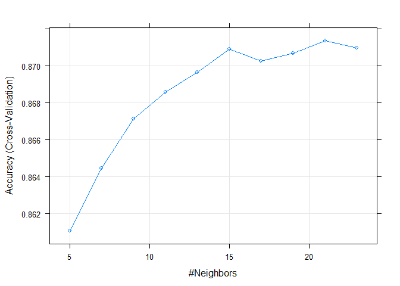

KNN
================
Chance Robinson
11/30/2019

  - [Exploratory Data Analysis](#exploratory-data-analysis)
      - [Library Imports](#library-imports)
      - [Load the CSV Data](#load-the-csv-data)
      - [Remove Missing Values](#remove-missing-values)
      - [Specify Model Columns of
        Interest](#specify-model-columns-of-interest)
      - [Prepare Dataframe](#prepare-dataframe)
      - [KNN Train / Test Split](#knn-train-test-split)
      - [KNN Parameter Tuning](#knn-parameter-tuning)
      - [KNN Performance](#knn-performance)

# Exploratory Data Analysis

## Library Imports

``` r
library(tidyverse)
```

    ## -- Attaching packages ------------------------------------------------------------------------------------------------------------ tidyverse 1.2.1 --

    ## v ggplot2 3.2.1     v purrr   0.3.3
    ## v tibble  2.1.3     v dplyr   0.8.3
    ## v tidyr   1.0.0     v stringr 1.4.0
    ## v readr   1.3.1     v forcats 0.4.0

    ## -- Conflicts --------------------------------------------------------------------------------------------------------------- tidyverse_conflicts() --
    ## x dplyr::filter() masks stats::filter()
    ## x dplyr::lag()    masks stats::lag()

``` r
# KNN
library(caret)
```

    ## Loading required package: lattice

    ## 
    ## Attaching package: 'caret'

    ## The following object is masked from 'package:purrr':
    ## 
    ##     lift

``` r
library(class)
```

## Load the CSV Data

``` r
data <- read.csv("../../../data/pubg_solo_game_types.csv", stringsAsFactors=FALSE)
```

``` r
head(data)
```

    ##               Id        groupId        matchId assists boosts damageDealt DBNOs
    ## 1 269c3fc4a26935 3c07be51998e6f ce9bc89b3ca08c       0      1      100.00     0
    ## 2 73348483a5974b 1c8e486a643207 85601fe44d519b       0      0       17.81     0
    ## 3 caa1a36afeb7b2 c653cfca3b8b06 e5e181d2da0334       0      1      100.00     0
    ## 4 5fd62798396ca8 bb19a05801d30d 9e3c46f8acde82       0      0       36.00     0
    ## 5 18d002b46b1abc 00a3f236559532 eccc44618c0442       0      1      236.00     0
    ## 6 d08ce24e7a7973 d57ed9de010a4e 1eda9747e31f1f       0      0        0.00     0
    ##   headshotKills heals killPlace killPoints kills killStreaks longestKill
    ## 1             0     0        24          0     1           1      21.250
    ## 2             0     0        79       1274     0           0       0.000
    ## 3             0     0        38       1000     1           1       7.667
    ## 4             0     0        84          0     0           0       0.000
    ## 5             0     7         7       1142     3           1      11.720
    ## 6             0     0        65          0     0           0       0.000
    ##   matchDuration matchType maxPlace numGroups rankPoints revives rideDistance
    ## 1          1398      solo       92        89       1509       0          0.0
    ## 2          1945      solo       99        95         -1       0        129.3
    ## 3          2042      solo       90        86         -1       0          0.0
    ## 4          1999      solo       94        92       1507       0          0.0
    ## 5          1423      solo       94        88         -1       0          0.0
    ## 6          1471      solo       99        94       1500       0          0.0
    ##   roadKills swimDistance teamKills vehicleDestroys walkDistance weaponsAcquired
    ## 1         0           61         0               0       1528.0               3
    ## 2         0            0         0               0        471.9               3
    ## 3         0            0         0               0        231.7               4
    ## 4         0            0         0               0        292.6               1
    ## 5         0            0         0               0       1913.0               8
    ## 6         0            0         0               0        870.9               3
    ##   winPoints winPlacePerc top.10
    ## 1         0       0.8462      0
    ## 2      1536       0.2245      0
    ## 3      1500       0.1573      0
    ## 4         0       0.1075      0
    ## 5      1557       0.9355      1
    ## 6         0       0.3878      0

## Remove Missing Values

``` r
# remove the row with no winPlacePerc   
data <- data[!data$Id == 'f70c74418bb064',]
```

## Specify Model Columns of Interest

``` r
cols_to_keep = c("walkDistance", "killPlace", "boosts", "weaponsAcquired", "damageDealt", "heals", "kills", "top.10")

head(data[cols_to_keep])
```

    ##   walkDistance killPlace boosts weaponsAcquired damageDealt heals kills top.10
    ## 1       1528.0        24      1               3      100.00     0     1      0
    ## 2        471.9        79      0               3       17.81     0     0      0
    ## 3        231.7        38      1               4      100.00     0     1      0
    ## 4        292.6        84      0               1       36.00     0     0      0
    ## 5       1913.0         7      1               8      236.00     7     3      1
    ## 6        870.9        65      0               3        0.00     0     0      0

## Prepare Dataframe

``` r
data.mod <- data %>%
  select(cols_to_keep) %>%
  mutate(top.10 = factor(top.10, labels = c("No", "Yes"))) 

summary(data.mod)
```

    ##   walkDistance       killPlace          boosts       weaponsAcquired 
    ##  Min.   :    0.0   Min.   :  1.00   Min.   : 0.000   Min.   : 0.000  
    ##  1st Qu.:  114.0   1st Qu.: 21.00   1st Qu.: 0.000   1st Qu.: 2.000  
    ##  Median :  607.7   Median : 46.00   Median : 0.000   Median : 3.000  
    ##  Mean   :  986.2   Mean   : 46.17   Mean   : 1.066   Mean   : 3.757  
    ##  3rd Qu.: 1616.0   3rd Qu.: 70.00   3rd Qu.: 2.000   3rd Qu.: 5.000  
    ##  Max.   :15370.0   Max.   :100.00   Max.   :24.000   Max.   :52.000  
    ##   damageDealt          heals            kills         top.10      
    ##  Min.   :   0.00   Min.   : 0.000   Min.   : 0.0000   No :162933  
    ##  1st Qu.:   0.00   1st Qu.: 0.000   1st Qu.: 0.0000   Yes: 19010  
    ##  Median :  65.73   Median : 0.000   Median : 0.0000               
    ##  Mean   : 112.62   Mean   : 1.012   Mean   : 0.8709               
    ##  3rd Qu.: 159.60   3rd Qu.: 1.000   3rd Qu.: 1.0000               
    ##  Max.   :2490.00   Max.   :49.000   Max.   :21.0000

``` r
# str(data.mod)
```

## KNN Train / Test Split

``` r
# sample.data <- sample_frac(data.mod, 1)
# 
# sample.data <- downSample(sample.data, sample.data$top.10, list = FALSE)
# sample.data$Class <- NULL

set.seed(1234)

train.indices <- createDataPartition(y = data.mod$top.10,p = 0.70, list = FALSE)
train <- data.mod[train.indices,]
test <- data.mod[-train.indices,]

train <- downSample(train, train$top.10, list = FALSE)
train$Class <- NULL


set.seed(1234)
ctrl <- trainControl(method="cv")
knn.model <- train(top.10 ~ ., data = train, method = "knn", trControl = ctrl, preProcess = c("center","scale"), tuneLength = 10)


# table(sample.data$top.10)

# dim(sample.data) # 14800     
# dim(train) # 10360     
# dim(test) # 4440   
```

## KNN Parameter Tuning

``` r
knn.model
```

    ## k-Nearest Neighbors 
    ## 
    ## 26614 samples
    ##     7 predictor
    ##     2 classes: 'No', 'Yes' 
    ## 
    ## Pre-processing: centered (7), scaled (7) 
    ## Resampling: Cross-Validated (10 fold) 
    ## Summary of sample sizes: 23952, 23953, 23952, 23953, 23952, 23953, ... 
    ## Resampling results across tuning parameters:
    ## 
    ##   k   Accuracy   Kappa    
    ##    5  0.8610879  0.7221760
    ##    7  0.8644696  0.7289394
    ##    9  0.8671373  0.7342750
    ##   11  0.8686027  0.7372057
    ##   13  0.8696548  0.7393099
    ##   15  0.8708944  0.7417893
    ##   17  0.8702557  0.7405118
    ##   19  0.8706691  0.7413385
    ##   21  0.8713454  0.7426910
    ##   23  0.8709697  0.7419396
    ## 
    ## Accuracy was used to select the optimal model using the largest value.
    ## The final value used for the model was k = 21.

``` r
plot(knn.model)
```

<!-- -->

## KNN Performance

``` r
knn.predict <- predict(knn.model, newdata = test )
confusionMatrix(knn.predict, test$top.10, "Yes")
```

    ## Confusion Matrix and Statistics
    ## 
    ##           Reference
    ## Prediction    No   Yes
    ##        No  40015   399
    ##        Yes  8864  5304
    ##                                           
    ##                Accuracy : 0.8303          
    ##                  95% CI : (0.8271, 0.8334)
    ##     No Information Rate : 0.8955          
    ##     P-Value [Acc > NIR] : 1               
    ##                                           
    ##                   Kappa : 0.4522          
    ##                                           
    ##  Mcnemar's Test P-Value : <2e-16          
    ##                                           
    ##             Sensitivity : 0.93004         
    ##             Specificity : 0.81865         
    ##          Pos Pred Value : 0.37436         
    ##          Neg Pred Value : 0.99013         
    ##              Prevalence : 0.10448         
    ##          Detection Rate : 0.09717         
    ##    Detection Prevalence : 0.25957         
    ##       Balanced Accuracy : 0.87435         
    ##                                           
    ##        'Positive' Class : Yes             
    ##
