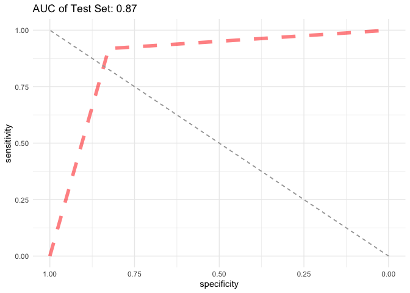

Random Forest
================
Chance Robinson
12/02/2019

# Exploratory Data Analysis

## Library Imports

``` r
# LDA
library(MASS)
# General functionality
library(tidyverse)
```

    ## ── Attaching packages ─────────────────────────────────────────────────────────────────────────────────────────────────────────── tidyverse 1.2.1 ──

    ## ✔ ggplot2 3.2.0     ✔ purrr   0.3.2
    ## ✔ tibble  2.1.3     ✔ dplyr   0.8.3
    ## ✔ tidyr   0.8.3     ✔ stringr 1.4.0
    ## ✔ readr   1.3.1     ✔ forcats 0.4.0

    ## ── Conflicts ────────────────────────────────────────────────────────────────────────────────────────────────────────────── tidyverse_conflicts() ──
    ## ✖ dplyr::filter() masks stats::filter()
    ## ✖ dplyr::lag()    masks stats::lag()
    ## ✖ dplyr::select() masks MASS::select()

``` r
# downSample
library(caret)
```

    ## Loading required package: lattice

    ## 
    ## Attaching package: 'caret'

    ## The following object is masked from 'package:purrr':
    ## 
    ##     lift

``` r
# ROC Curves
library(ROCR)
```

    ## Loading required package: gplots

    ## 
    ## Attaching package: 'gplots'

    ## The following object is masked from 'package:stats':
    ## 
    ##     lowess

``` r
library(pROC)
```

    ## Type 'citation("pROC")' for a citation.

    ## 
    ## Attaching package: 'pROC'

    ## The following objects are masked from 'package:stats':
    ## 
    ##     cov, smooth, var

## Load the CSV Data

``` r
data <- read.csv("../../../data/pubg_solo_game_types.csv", stringsAsFactors=FALSE)
```

``` r
head(data)
```

    ##               Id        groupId        matchId assists boosts damageDealt
    ## 1 269c3fc4a26935 3c07be51998e6f ce9bc89b3ca08c       0      1      100.00
    ## 2 73348483a5974b 1c8e486a643207 85601fe44d519b       0      0       17.81
    ## 3 caa1a36afeb7b2 c653cfca3b8b06 e5e181d2da0334       0      1      100.00
    ## 4 5fd62798396ca8 bb19a05801d30d 9e3c46f8acde82       0      0       36.00
    ## 5 18d002b46b1abc 00a3f236559532 eccc44618c0442       0      1      236.00
    ## 6 d08ce24e7a7973 d57ed9de010a4e 1eda9747e31f1f       0      0        0.00
    ##   DBNOs headshotKills heals killPlace killPoints kills killStreaks
    ## 1     0             0     0        24          0     1           1
    ## 2     0             0     0        79       1274     0           0
    ## 3     0             0     0        38       1000     1           1
    ## 4     0             0     0        84          0     0           0
    ## 5     0             0     7         7       1142     3           1
    ## 6     0             0     0        65          0     0           0
    ##   longestKill matchDuration matchType maxPlace numGroups rankPoints
    ## 1      21.250          1398      solo       92        89       1509
    ## 2       0.000          1945      solo       99        95         -1
    ## 3       7.667          2042      solo       90        86         -1
    ## 4       0.000          1999      solo       94        92       1507
    ## 5      11.720          1423      solo       94        88         -1
    ## 6       0.000          1471      solo       99        94       1500
    ##   revives rideDistance roadKills swimDistance teamKills vehicleDestroys
    ## 1       0          0.0         0           61         0               0
    ## 2       0        129.3         0            0         0               0
    ## 3       0          0.0         0            0         0               0
    ## 4       0          0.0         0            0         0               0
    ## 5       0          0.0         0            0         0               0
    ## 6       0          0.0         0            0         0               0
    ##   walkDistance weaponsAcquired winPoints winPlacePerc top.10
    ## 1       1528.0               3         0       0.8462      0
    ## 2        471.9               3      1536       0.2245      0
    ## 3        231.7               4      1500       0.1573      0
    ## 4        292.6               1         0       0.1075      0
    ## 5       1913.0               8      1557       0.9355      1
    ## 6        870.9               3         0       0.3878      0

## Remove Missing Values

``` r
# remove the row with no winPlacePerc   
data <- data[!data$Id == 'f70c74418bb064',]
```

## Specify Model Columns of Interest

``` r
cols_to_keep <- c("walkDistance", "killPlace", "boosts", "weaponsAcquired", "damageDealt", "heals", "kills", "top.10")

cols_to_remove <- c("Id", "groupId", "matchId", "matchType", "DBNOs", "revives", "winPlacePerc")

head(data[cols_to_keep])
```

    ##   walkDistance killPlace boosts weaponsAcquired damageDealt heals kills
    ## 1       1528.0        24      1               3      100.00     0     1
    ## 2        471.9        79      0               3       17.81     0     0
    ## 3        231.7        38      1               4      100.00     0     1
    ## 4        292.6        84      0               1       36.00     0     0
    ## 5       1913.0         7      1               8      236.00     7     3
    ## 6        870.9        65      0               3        0.00     0     0
    ##   top.10
    ## 1      0
    ## 2      0
    ## 3      0
    ## 4      0
    ## 5      1
    ## 6      0

## Prepare Dataframe

``` r
data.mod <- data %>%
  select(-cols_to_remove) %>%
  mutate(top.10 = factor(top.10, labels = c("No", "Yes"))) 

summary(data.mod)
```

    ##     assists            boosts        damageDealt      headshotKills    
    ##  Min.   :0.00000   Min.   : 0.000   Min.   :   0.00   Min.   : 0.0000  
    ##  1st Qu.:0.00000   1st Qu.: 0.000   1st Qu.:   0.00   1st Qu.: 0.0000  
    ##  Median :0.00000   Median : 0.000   Median :  65.73   Median : 0.0000  
    ##  Mean   :0.05562   Mean   : 1.066   Mean   : 112.62   Mean   : 0.2238  
    ##  3rd Qu.:0.00000   3rd Qu.: 2.000   3rd Qu.: 159.60   3rd Qu.: 0.0000  
    ##  Max.   :4.00000   Max.   :24.000   Max.   :2490.00   Max.   :19.0000  
    ##      heals          killPlace        killPoints         kills        
    ##  Min.   : 0.000   Min.   :  1.00   Min.   :   0.0   Min.   : 0.0000  
    ##  1st Qu.: 0.000   1st Qu.: 21.00   1st Qu.:   0.0   1st Qu.: 0.0000  
    ##  Median : 0.000   Median : 46.00   Median :   0.0   Median : 0.0000  
    ##  Mean   : 1.012   Mean   : 46.17   Mean   : 407.8   Mean   : 0.8709  
    ##  3rd Qu.: 1.000   3rd Qu.: 70.00   3rd Qu.:1032.0   3rd Qu.: 1.0000  
    ##  Max.   :49.000   Max.   :100.00   Max.   :1962.0   Max.   :21.0000  
    ##   killStreaks       longestKill      matchDuration     maxPlace     
    ##  Min.   : 0.0000   Min.   :   0.00   Min.   : 950   Min.   : 11.00  
    ##  1st Qu.: 0.0000   1st Qu.:   0.00   1st Qu.:1431   1st Qu.: 93.00  
    ##  Median : 0.0000   Median :   0.00   Median :1771   Median : 96.00  
    ##  Mean   : 0.4429   Mean   :  20.70   Mean   :1676   Mean   : 91.34  
    ##  3rd Qu.: 1.0000   3rd Qu.:  15.91   3rd Qu.:1903   3rd Qu.: 97.00  
    ##  Max.   :18.0000   Max.   :1001.00   Max.   :2237   Max.   :100.00  
    ##    numGroups       rankPoints      rideDistance        roadKills        
    ##  Min.   : 1.00   Min.   :  -1.0   Min.   :    0.00   Min.   : 0.000000  
    ##  1st Qu.:89.00   1st Qu.:  -1.0   1st Qu.:    0.00   1st Qu.: 0.000000  
    ##  Median :92.00   Median :1494.0   Median :    0.00   Median : 0.000000  
    ##  Mean   :87.29   Mean   : 978.5   Mean   :  640.98   Mean   : 0.009948  
    ##  3rd Qu.:94.00   3rd Qu.:1510.0   3rd Qu.:    1.16   3rd Qu.: 0.000000  
    ##  Max.   :99.00   Max.   :2857.0   Max.   :33970.00   Max.   :18.000000  
    ##   swimDistance        teamKills       vehicleDestroys    walkDistance    
    ##  Min.   :   0.000   Min.   :0.00000   Min.   :0.00000   Min.   :    0.0  
    ##  1st Qu.:   0.000   1st Qu.:0.00000   1st Qu.:0.00000   1st Qu.:  114.0  
    ##  Median :   0.000   Median :0.00000   Median :0.00000   Median :  607.7  
    ##  Mean   :   5.878   Mean   :0.01499   Mean   :0.00753   Mean   :  986.2  
    ##  3rd Qu.:   0.000   3rd Qu.:0.00000   3rd Qu.:0.00000   3rd Qu.: 1616.0  
    ##  Max.   :1606.000   Max.   :1.00000   Max.   :3.00000   Max.   :15370.0  
    ##  weaponsAcquired    winPoints      top.10      
    ##  Min.   : 0.000   Min.   :   0.0   No :162933  
    ##  1st Qu.: 2.000   1st Qu.:   0.0   Yes: 19010  
    ##  Median : 3.000   Median :   0.0               
    ##  Mean   : 3.757   Mean   : 536.9               
    ##  3rd Qu.: 5.000   3rd Qu.:1492.0               
    ##  Max.   :52.000   Max.   :1892.0

## LDA

## Train / Test Split

``` r
set.seed(1234)

split.perc = .70

train.indices = sample(1:dim(data.mod)[1],round(split.perc * dim(data.mod)[1]))

train = data.mod[train.indices,]
test = data.mod[-train.indices,]

train <- downSample(train, train$top.10, list = FALSE)
train$Class <- NULL

model.lda.train <- lda(top.10 ~ ., data = train)

p1 <- predict(model.lda.train, train)

p2 <- predict(model.lda.train, test)
```

## LDA Performance

### Train

``` r
confusionMatrix(data=p1$class,
                reference=train$top.10, "Yes")
```

    ## Confusion Matrix and Statistics
    ## 
    ##           Reference
    ## Prediction    No   Yes
    ##        No  11031   997
    ##        Yes  2305 12339
    ##                                           
    ##                Accuracy : 0.8762          
    ##                  95% CI : (0.8722, 0.8801)
    ##     No Information Rate : 0.5             
    ##     P-Value [Acc > NIR] : < 2.2e-16       
    ##                                           
    ##                   Kappa : 0.7524          
    ##                                           
    ##  Mcnemar's Test P-Value : < 2.2e-16       
    ##                                           
    ##             Sensitivity : 0.9252          
    ##             Specificity : 0.8272          
    ##          Pos Pred Value : 0.8426          
    ##          Neg Pred Value : 0.9171          
    ##              Prevalence : 0.5000          
    ##          Detection Rate : 0.4626          
    ##    Detection Prevalence : 0.5490          
    ##       Balanced Accuracy : 0.8762          
    ##                                           
    ##        'Positive' Class : Yes             
    ## 

### Test

``` r
confusionMatrix(data=p2$class,
                reference=test$top.10, "Yes")
```

    ## Confusion Matrix and Statistics
    ## 
    ##           Reference
    ## Prediction    No   Yes
    ##        No  40407   462
    ##        Yes  8502  5212
    ##                                           
    ##                Accuracy : 0.8358          
    ##                  95% CI : (0.8326, 0.8389)
    ##     No Information Rate : 0.896           
    ##     P-Value [Acc > NIR] : 1               
    ##                                           
    ##                   Kappa : 0.4579          
    ##                                           
    ##  Mcnemar's Test P-Value : <2e-16          
    ##                                           
    ##             Sensitivity : 0.91858         
    ##             Specificity : 0.82617         
    ##          Pos Pred Value : 0.38005         
    ##          Neg Pred Value : 0.98870         
    ##              Prevalence : 0.10395         
    ##          Detection Rate : 0.09549         
    ##    Detection Prevalence : 0.25125         
    ##       Balanced Accuracy : 0.87237         
    ##                                           
    ##        'Positive' Class : Yes             
    ## 

### Area Under the Curve

``` r
# ?pROC

auc <- roc(as.integer(test$top.10), as.integer(p2$class))
```

    ## Setting levels: control = 1, case = 2

    ## Setting direction: controls < cases

``` r
# print(auc)

# plot(auc, ylim=c(0,1), print.thres=TRUE, main=paste('AUC of Test Set:', round(auc$auc[[1]],2)))
# abline(h=1,col='green',lwd=2)
# abline(h=0,col='red',lwd=2)

g <- ggroc(auc, alpha = 0.5, colour = "red", linetype = 2, size = 2) +
  theme_minimal() + 
  ggtitle(paste('AUC of Test Set:', round(auc$auc[[1]],2))) + 
  geom_segment(aes(x = 0, xend = 1, y = 0, yend = 1), color="darkgrey", linetype="dashed")
  


plot(g)
```

<!-- -->
