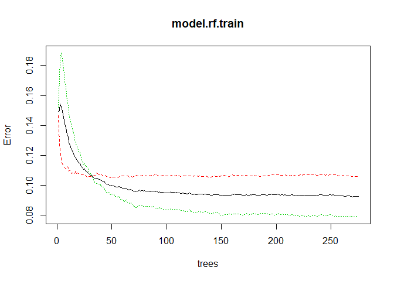
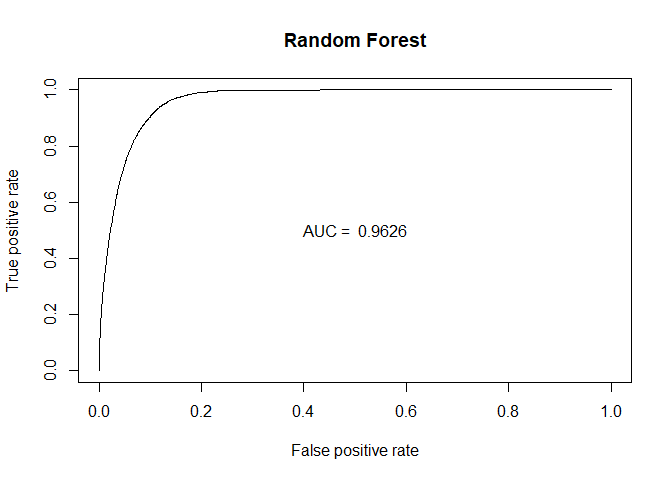

Random Forest
================
Chance Robinson
11/30/2019

  - [Exploratory Data Analysis](#exploratory-data-analysis)
      - [Library Imports](#library-imports)
      - [Load the CSV Data](#load-the-csv-data)
      - [Remove Missing Values](#remove-missing-values)
      - [Specify Model Columns of
        Interest](#specify-model-columns-of-interest)
      - [Prepare Dataframe](#prepare-dataframe)
      - [Random Forrest](#random-forrest)
      - [Train / Test Split](#train-test-split)
      - [Random Forest Performance](#random-forest-performance)
          - [Train](#train)
          - [Test](#test)
          - [Area Under the Curve](#area-under-the-curve)

# Exploratory Data Analysis

## Library Imports

``` r
library(tidyverse)
```

    ## -- Attaching packages -------------------------------------------------------------------------------------------------------- tidyverse 1.2.1 --

    ## v ggplot2 3.2.1     v purrr   0.3.3
    ## v tibble  2.1.3     v dplyr   0.8.3
    ## v tidyr   1.0.0     v stringr 1.4.0
    ## v readr   1.3.1     v forcats 0.4.0

    ## -- Conflicts ----------------------------------------------------------------------------------------------------------- tidyverse_conflicts() --
    ## x dplyr::filter() masks stats::filter()
    ## x dplyr::lag()    masks stats::lag()

``` r
# Random Forest
library(randomForest)  
```

    ## randomForest 4.6-14

    ## Type rfNews() to see new features/changes/bug fixes.

    ## 
    ## Attaching package: 'randomForest'

    ## The following object is masked from 'package:dplyr':
    ## 
    ##     combine

    ## The following object is masked from 'package:ggplot2':
    ## 
    ##     margin

``` r
library(e1071)  
# downSample
library(caret)
```

    ## Loading required package: lattice

    ## 
    ## Attaching package: 'caret'

    ## The following object is masked from 'package:purrr':
    ## 
    ##     lift

``` r
# ROC Curves
library(ROCR)
```

    ## Loading required package: gplots

    ## 
    ## Attaching package: 'gplots'

    ## The following object is masked from 'package:stats':
    ## 
    ##     lowess

``` r
library(pROC)
```

    ## Type 'citation("pROC")' for a citation.

    ## 
    ## Attaching package: 'pROC'

    ## The following objects are masked from 'package:stats':
    ## 
    ##     cov, smooth, var

## Load the CSV Data

``` r
data <- read.csv("../../../data/pubg_solo_game_types.csv", stringsAsFactors=FALSE)
```

``` r
head(data)
```

    ##               Id        groupId        matchId assists boosts damageDealt DBNOs
    ## 1 269c3fc4a26935 3c07be51998e6f ce9bc89b3ca08c       0      1      100.00     0
    ## 2 73348483a5974b 1c8e486a643207 85601fe44d519b       0      0       17.81     0
    ## 3 caa1a36afeb7b2 c653cfca3b8b06 e5e181d2da0334       0      1      100.00     0
    ## 4 5fd62798396ca8 bb19a05801d30d 9e3c46f8acde82       0      0       36.00     0
    ## 5 18d002b46b1abc 00a3f236559532 eccc44618c0442       0      1      236.00     0
    ## 6 d08ce24e7a7973 d57ed9de010a4e 1eda9747e31f1f       0      0        0.00     0
    ##   headshotKills heals killPlace killPoints kills killStreaks longestKill
    ## 1             0     0        24          0     1           1      21.250
    ## 2             0     0        79       1274     0           0       0.000
    ## 3             0     0        38       1000     1           1       7.667
    ## 4             0     0        84          0     0           0       0.000
    ## 5             0     7         7       1142     3           1      11.720
    ## 6             0     0        65          0     0           0       0.000
    ##   matchDuration matchType maxPlace numGroups rankPoints revives rideDistance
    ## 1          1398      solo       92        89       1509       0          0.0
    ## 2          1945      solo       99        95         -1       0        129.3
    ## 3          2042      solo       90        86         -1       0          0.0
    ## 4          1999      solo       94        92       1507       0          0.0
    ## 5          1423      solo       94        88         -1       0          0.0
    ## 6          1471      solo       99        94       1500       0          0.0
    ##   roadKills swimDistance teamKills vehicleDestroys walkDistance weaponsAcquired
    ## 1         0           61         0               0       1528.0               3
    ## 2         0            0         0               0        471.9               3
    ## 3         0            0         0               0        231.7               4
    ## 4         0            0         0               0        292.6               1
    ## 5         0            0         0               0       1913.0               8
    ## 6         0            0         0               0        870.9               3
    ##   winPoints winPlacePerc top.10
    ## 1         0       0.8462      0
    ## 2      1536       0.2245      0
    ## 3      1500       0.1573      0
    ## 4         0       0.1075      0
    ## 5      1557       0.9355      1
    ## 6         0       0.3878      0

## Remove Missing Values

``` r
# remove the row with no winPlacePerc   
data <- data[!data$Id == 'f70c74418bb064',]


# summary(data$rankPoints)
# 
# data$rankPoints <- cut(data$rankPoints, breaks=5)
# 
# str(data$rankPoints)
# (data[data$winPoints == 0,])
# 
# (data[data$killPoints == 0,])
# 
# (data[data$rankPoints != -1,])


# data <- data %>%
#   filter(rankPoints != -1 & winPoints == 0) %>%
#   mutate(winPoints = 0)
# 
# data <- data %>%
#   filter(rankPoints != -1 & killPoints == 0) %>%
#   mutate(killPoints = 0)
# 
# 
# outliers <- data[   data$walkDistance > mean(data$walkDistance) + (sd(data$walkDistance) * 3), ]
# 
# outliers
# 
# outliers
# dim(data)
```

## Specify Model Columns of Interest

``` r
cols_to_keep = c("walkDistance", "killPlace", "boosts", "weaponsAcquired", "damageDealt", "heals", "kills", "top.10")

cols_to_remove = c("Id", "groupId", "matchId", "matchType", "DBNOs", "revives", "winPlacePerc")

head(data[cols_to_keep])
```

    ##   walkDistance killPlace boosts weaponsAcquired damageDealt heals kills top.10
    ## 1       1528.0        24      1               3      100.00     0     1      0
    ## 2        471.9        79      0               3       17.81     0     0      0
    ## 3        231.7        38      1               4      100.00     0     1      0
    ## 4        292.6        84      0               1       36.00     0     0      0
    ## 5       1913.0         7      1               8      236.00     7     3      1
    ## 6        870.9        65      0               3        0.00     0     0      0

## Prepare Dataframe

``` r
data.mod <- data %>%
  select(-cols_to_remove) %>%
  mutate(kills  = kills * 100 / numGroups) %>% # Normalized Kills
  mutate(matchDuration = as.factor(ifelse(matchDuration < mean(matchDuration), "Low", "High"))) %>%
  mutate(top.10 = factor(top.10, labels = c("No", "Yes"))) 

summary(data.mod)
```

    ##     assists            boosts        damageDealt      headshotKills    
    ##  Min.   :0.00000   Min.   : 0.000   Min.   :   0.00   Min.   : 0.0000  
    ##  1st Qu.:0.00000   1st Qu.: 0.000   1st Qu.:   0.00   1st Qu.: 0.0000  
    ##  Median :0.00000   Median : 0.000   Median :  65.73   Median : 0.0000  
    ##  Mean   :0.05562   Mean   : 1.066   Mean   : 112.62   Mean   : 0.2238  
    ##  3rd Qu.:0.00000   3rd Qu.: 2.000   3rd Qu.: 159.60   3rd Qu.: 0.0000  
    ##  Max.   :4.00000   Max.   :24.000   Max.   :2490.00   Max.   :19.0000  
    ##      heals          killPlace        killPoints         kills         
    ##  Min.   : 0.000   Min.   :  1.00   Min.   :   0.0   Min.   :  0.0000  
    ##  1st Qu.: 0.000   1st Qu.: 21.00   1st Qu.:   0.0   1st Qu.:  0.0000  
    ##  Median : 0.000   Median : 46.00   Median :   0.0   Median :  0.0000  
    ##  Mean   : 1.012   Mean   : 46.17   Mean   : 407.8   Mean   :  0.9649  
    ##  3rd Qu.: 1.000   3rd Qu.: 70.00   3rd Qu.:1032.0   3rd Qu.:  1.1236  
    ##  Max.   :49.000   Max.   :100.00   Max.   :1962.0   Max.   :100.0000  
    ##   killStreaks       longestKill      matchDuration    maxPlace     
    ##  Min.   : 0.0000   Min.   :   0.00   High:93981    Min.   : 11.00  
    ##  1st Qu.: 0.0000   1st Qu.:   0.00   Low :87962    1st Qu.: 93.00  
    ##  Median : 0.0000   Median :   0.00                 Median : 96.00  
    ##  Mean   : 0.4429   Mean   :  20.70                 Mean   : 91.34  
    ##  3rd Qu.: 1.0000   3rd Qu.:  15.91                 3rd Qu.: 97.00  
    ##  Max.   :18.0000   Max.   :1001.00                 Max.   :100.00  
    ##    numGroups       rankPoints      rideDistance        roadKills        
    ##  Min.   : 1.00   Min.   :  -1.0   Min.   :    0.00   Min.   : 0.000000  
    ##  1st Qu.:89.00   1st Qu.:  -1.0   1st Qu.:    0.00   1st Qu.: 0.000000  
    ##  Median :92.00   Median :1494.0   Median :    0.00   Median : 0.000000  
    ##  Mean   :87.29   Mean   : 978.5   Mean   :  640.98   Mean   : 0.009948  
    ##  3rd Qu.:94.00   3rd Qu.:1510.0   3rd Qu.:    1.16   3rd Qu.: 0.000000  
    ##  Max.   :99.00   Max.   :2857.0   Max.   :33970.00   Max.   :18.000000  
    ##   swimDistance        teamKills       vehicleDestroys    walkDistance    
    ##  Min.   :   0.000   Min.   :0.00000   Min.   :0.00000   Min.   :    0.0  
    ##  1st Qu.:   0.000   1st Qu.:0.00000   1st Qu.:0.00000   1st Qu.:  114.0  
    ##  Median :   0.000   Median :0.00000   Median :0.00000   Median :  607.7  
    ##  Mean   :   5.878   Mean   :0.01499   Mean   :0.00753   Mean   :  986.2  
    ##  3rd Qu.:   0.000   3rd Qu.:0.00000   3rd Qu.:0.00000   3rd Qu.: 1616.0  
    ##  Max.   :1606.000   Max.   :1.00000   Max.   :3.00000   Max.   :15370.0  
    ##  weaponsAcquired    winPoints      top.10      
    ##  Min.   : 0.000   Min.   :   0.0   No :162933  
    ##  1st Qu.: 2.000   1st Qu.:   0.0   Yes: 19010  
    ##  Median : 3.000   Median :   0.0               
    ##  Mean   : 3.757   Mean   : 536.9               
    ##  3rd Qu.: 5.000   3rd Qu.:1492.0               
    ##  Max.   :52.000   Max.   :1892.0

``` r
# str(data.mod)
```

## Random Forrest

## Train / Test Split

``` r
set.seed(1234)

sample.data <- sample_frac(data.mod, 1)

# sample.data <- downSample(sample.data, sample.data$top.10, list = FALSE)
# sample.data$Class <- NULL

# head(sample.data)

split.perc = .70

train.indices = sample(1:dim(sample.data)[1],round(split.perc * dim(sample.data)[1]))

train = sample.data[train.indices,]
test = sample.data[-train.indices,]

train <- downSample(train, train$top.10, list = FALSE)
train$Class <- NULL

set.seed(1234)
model.rf.train <- randomForest(top.10 ~ ., data = train, ntree = 275, mtry = 8, cutoff = c(0.4,1-0.4))

?randomForest
```

    ## starting httpd help server ... done

``` r
print(model.rf.train)
```

    ## 
    ## Call:
    ##  randomForest(formula = top.10 ~ ., data = train, ntree = 275,      mtry = 8, cutoff = c(0.4, 1 - 0.4)) 
    ##                Type of random forest: classification
    ##                      Number of trees: 275
    ## No. of variables tried at each split: 8
    ## 
    ##         OOB estimate of  error rate: 9.25%
    ## Confusion matrix:
    ##        No   Yes class.error
    ## No  11928  1405  0.10537763
    ## Yes  1061 12272  0.07957699

``` r
p1 <- predict(model.rf.train, train)
p2 <- predict(model.rf.train, test)

head(p1)
```

    ##  1  2  3  4  5  6 
    ## No No No No No No 
    ## Levels: No Yes

``` r
plot(model.rf.train) 
```

<!-- -->

``` r
varImp(model.rf.train)
```

    ##                     Overall
    ## assists           45.094247
    ## boosts          1498.298345
    ## damageDealt      696.990203
    ## headshotKills     64.458702
    ## heals            264.255592
    ## killPlace       4387.191278
    ## killPoints       162.551498
    ## kills            846.404425
    ## killStreaks      218.326392
    ## longestKill      539.348638
    ## matchDuration    104.437461
    ## maxPlace         336.300578
    ## numGroups        389.473170
    ## rankPoints       290.960233
    ## rideDistance     286.442093
    ## roadKills          8.679033
    ## swimDistance     114.371977
    ## teamKills         16.472354
    ## vehicleDestroys   17.332922
    ## walkDistance    2557.154915
    ## weaponsAcquired  289.186219
    ## winPoints        171.841342

## Random Forest Performance

### Train

``` r
confusionMatrix(data=p1,  
                reference=train$top.10, "Yes")
```

    ## Confusion Matrix and Statistics
    ## 
    ##           Reference
    ## Prediction    No   Yes
    ##        No  13323     4
    ##        Yes    10 13329
    ##                                           
    ##                Accuracy : 0.9995          
    ##                  95% CI : (0.9991, 0.9997)
    ##     No Information Rate : 0.5             
    ##     P-Value [Acc > NIR] : <2e-16          
    ##                                           
    ##                   Kappa : 0.9989          
    ##                                           
    ##  Mcnemar's Test P-Value : 0.1814          
    ##                                           
    ##             Sensitivity : 0.9997          
    ##             Specificity : 0.9992          
    ##          Pos Pred Value : 0.9993          
    ##          Neg Pred Value : 0.9997          
    ##              Prevalence : 0.5000          
    ##          Detection Rate : 0.4998          
    ##    Detection Prevalence : 0.5002          
    ##       Balanced Accuracy : 0.9995          
    ##                                           
    ##        'Positive' Class : Yes             
    ## 

### Test

``` r
confusionMatrix(data=p2,  
                reference=test$top.10, "Yes")
```

    ## Confusion Matrix and Statistics
    ## 
    ##           Reference
    ## Prediction    No   Yes
    ##        No  43671   468
    ##        Yes  5235  5209
    ##                                           
    ##                Accuracy : 0.8955          
    ##                  95% CI : (0.8929, 0.8981)
    ##     No Information Rate : 0.896           
    ##     P-Value [Acc > NIR] : 0.6455          
    ##                                           
    ##                   Kappa : 0.5911          
    ##                                           
    ##  Mcnemar's Test P-Value : <2e-16          
    ##                                           
    ##             Sensitivity : 0.91756         
    ##             Specificity : 0.89296         
    ##          Pos Pred Value : 0.49876         
    ##          Neg Pred Value : 0.98940         
    ##              Prevalence : 0.10401         
    ##          Detection Rate : 0.09543         
    ##    Detection Prevalence : 0.19134         
    ##       Balanced Accuracy : 0.90526         
    ##                                           
    ##        'Positive' Class : Yes             
    ## 

### Area Under the Curve

``` r
# ?pROC

auc <- roc(as.integer(test$top.10), as.integer(p2))
```

    ## Setting levels: control = 1, case = 2

    ## Setting direction: controls < cases

``` r
# print(auc)

# plot(auc, ylim=c(0,1), print.thres=TRUE, main=paste('AUC of Test Set:', round(auc$auc[[1]],2)))
# abline(h=1,col='green',lwd=2)
# abline(h=0,col='red',lwd=2)

g <- ggroc(auc, alpha = 0.5, colour = "red", linetype = 2, size = 2) +
  theme_minimal() + 
  ggtitle(paste('AUC of Test Set:', round(auc$auc[[1]],2))) + 
  geom_segment(aes(x = 0, xend = 1, y = 0, yend = 1), color="darkgrey", linetype="dashed")
  

plot(g)
```

<!-- -->

``` r
plotRoc <- function(preds, truth) {
  pred <- prediction(preds, truth)
  roc.perf = performance(pred, measure = "tpr", x.measure = "fpr")
  auc.train <- performance(pred, measure = "auc")
  auc.train <- auc.train@y.values
  
  #Plot ROC
  par(mar=c(4,4,4,4))
  plot(roc.perf,main="Random Forest")
  abline(a=0, b= 1) #Ref line indicating poor performance
  text(x = .40, y = .6,paste("AUC = ", round(auc.train[[1]],3), sep = ""))
  table(test$top.10, useNA = "ifany")
}


plotRoc(as.integer(p2),as.integer(test$top.10))
```

<!-- -->

    ## 
    ##    No   Yes 
    ## 48906  5677

``` r
set.seed(1234)
train <- read.csv("../../../data/pubg_solo_game_types_train_downsampled.csv", stringsAsFactors=FALSE)

test <- read.csv("../../../data/pubg_solo_game_types_test_full.csv", stringsAsFactors=FALSE)


train <- train %>%
  select(-cols_to_remove) %>%
  mutate(kills  = kills * 100 / numGroups) %>% # Normalized Kills
  mutate(matchDuration = as.factor(ifelse(matchDuration < mean(matchDuration), "Low", "High"))) %>%
  mutate(top.10 = factor(top.10, labels = c("No", "Yes"))) 


test <- test %>%
  select(-cols_to_remove) %>%
  mutate(kills  = kills * 100 / numGroups) %>% # Normalized Kills
  mutate(matchDuration = as.factor(ifelse(matchDuration < mean(matchDuration), "Low", "High"))) %>%
  mutate(top.10 = factor(top.10, labels = c("No", "Yes"))) 


model.rf.train <- randomForest(as.factor(top.10) ~ ., 
                               data = train, 
                               ntree = 500, 
                               mtry = 12, 
                               cutoff = c(0.4,1-0.40))

print(model.rf.train)
```

    ## 
    ## Call:
    ##  randomForest(formula = as.factor(top.10) ~ ., data = train, ntree = 500,      mtry = 12, cutoff = c(0.4, 1 - 0.4)) 
    ##                Type of random forest: classification
    ##                      Number of trees: 500
    ## No. of variables tried at each split: 12
    ## 
    ##         OOB estimate of  error rate: 9.71%
    ## Confusion matrix:
    ##        No   Yes class.error
    ## No  11827  1480   0.1112197
    ## Yes  1105 12202   0.0830390

``` r
p1 <- predict(model.rf.train, train)
p2 <- predict(model.rf.train, test)


print(model.rf.train)
```

    ## 
    ## Call:
    ##  randomForest(formula = as.factor(top.10) ~ ., data = train, ntree = 500,      mtry = 12, cutoff = c(0.4, 1 - 0.4)) 
    ##                Type of random forest: classification
    ##                      Number of trees: 500
    ## No. of variables tried at each split: 12
    ## 
    ##         OOB estimate of  error rate: 9.71%
    ## Confusion matrix:
    ##        No   Yes class.error
    ## No  11827  1480   0.1112197
    ## Yes  1105 12202   0.0830390

``` r
plot(model.rf.train)
```

<!-- -->

``` r
varImp(model.rf.train)
```

    ##                    Overall
    ## assists           43.62334
    ## boosts          1157.86767
    ## damageDealt      587.86497
    ## headshotKills     61.26146
    ## heals            209.00441
    ## killPlace       5172.69584
    ## killPoints       155.16722
    ## kills            635.76974
    ## killStreaks      159.01334
    ## longestKill      386.08015
    ## matchDuration    105.38803
    ## maxPlace         326.37764
    ## numGroups        367.23582
    ## rankPoints       289.94210
    ## rideDistance     270.77805
    ## roadKills         13.37229
    ## swimDistance      96.74467
    ## teamKills         22.79068
    ## vehicleDestroys   13.58180
    ## walkDistance    2802.62385
    ## weaponsAcquired  261.50104
    ## winPoints        155.96105

``` r
confusionMatrix(data=p1,
                reference=train$top.10, "Yes")
```

    ## Confusion Matrix and Statistics
    ## 
    ##           Reference
    ## Prediction    No   Yes
    ##        No  13303     2
    ##        Yes     4 13305
    ##                                           
    ##                Accuracy : 0.9998          
    ##                  95% CI : (0.9995, 0.9999)
    ##     No Information Rate : 0.5             
    ##     P-Value [Acc > NIR] : <2e-16          
    ##                                           
    ##                   Kappa : 0.9995          
    ##                                           
    ##  Mcnemar's Test P-Value : 0.6831          
    ##                                           
    ##             Sensitivity : 0.9998          
    ##             Specificity : 0.9997          
    ##          Pos Pred Value : 0.9997          
    ##          Neg Pred Value : 0.9998          
    ##              Prevalence : 0.5000          
    ##          Detection Rate : 0.4999          
    ##    Detection Prevalence : 0.5001          
    ##       Balanced Accuracy : 0.9998          
    ##                                           
    ##        'Positive' Class : Yes             
    ## 

``` r
confusionMatrix(data=p2,
                reference=test$top.10, "Yes")
```

    ## Confusion Matrix and Statistics
    ## 
    ##           Reference
    ## Prediction    No   Yes
    ##        No  43690   467
    ##        Yes  5189  5236
    ##                                           
    ##                Accuracy : 0.8964          
    ##                  95% CI : (0.8938, 0.8989)
    ##     No Information Rate : 0.8955          
    ##     P-Value [Acc > NIR] : 0.258           
    ##                                           
    ##                   Kappa : 0.5945          
    ##                                           
    ##  Mcnemar's Test P-Value : <2e-16          
    ##                                           
    ##             Sensitivity : 0.91811         
    ##             Specificity : 0.89384         
    ##          Pos Pred Value : 0.50225         
    ##          Neg Pred Value : 0.98942         
    ##              Prevalence : 0.10448         
    ##          Detection Rate : 0.09593         
    ##    Detection Prevalence : 0.19100         
    ##       Balanced Accuracy : 0.90598         
    ##                                           
    ##        'Positive' Class : Yes             
    ## 

``` r
plotRoc <- function(preds, truth) {
  pred <- prediction(preds, truth)
  roc.perf = performance(pred, measure = "tpr", x.measure = "fpr")
  auc.train <- performance(pred, measure = "auc")
  auc.train <- auc.train@y.values
  #Plot ROC
  par(mar=c(4,4,4,4))
  plot(roc.perf,main="Random Forest")
  abline(a=0, b= 1) #Ref line indicating poor performance
  text(x = .40, y = .6,paste("AUC = ", round(auc.train[[1]],3), sep = ""))
  table(test$top.10, useNA = "ifany")
}


plotRoc(as.integer(p2),as.integer(test$top.10))
```

<!-- -->

    ## 
    ##    No   Yes 
    ## 48879  5703

``` r
#Create control function for training with 10 folds and keep 3 folds for training. search method is grid.
# control <- trainControl(method='repeatedcv', 
#                         number=10, 
#                         repeats=3, 
#                         search='grid')
# #create tunegrid with 15 values from 1:15 for mtry to tunning model. Our train function will change number of entry variable at each split according to tunegrid. 
# tunegrid <- expand.grid(.mtry = (2:16)) 
# 
# # ?train
# 
# rf_gridsearch <- train(top.10 ~ ., 
#                        data = train,
#                        method = 'rf',
#                        metric = 'Accuracy',
#                        tuneGrid = tunegrid)
# print(rf_gridsearch)
```

``` r
#Create control function for training with 10 folds and keep 3 folds for training. search method is grid.
# control <- trainControl(method='repeatedcv', 
#                         number=10, 
#                         repeats=3, 
#                         search='grid')
# #create tunegrid with 15 values from 1:15 for mtry to tunning model. Our train function will change number of entry variable at each split according to tunegrid. 
# tunegrid <- expand.grid(.mtry = (2:16)) 
# 
# # ?train
# 
# rf_gridsearch <- train(top.10 ~ ., 
#                        data = test,
#                        method = 'rf',
#                        metric = 'Accuracy',
#                        tuneGrid = tunegrid)
# print(rf_gridsearch)
```

``` r
# head(test)
# obj <- tuneRF(train[,-23], train[,23],
#        mtryStart = 8,
#        stepFactor = 1.5,
#        ntreeTry = 500,
#        trace = TRUE,
#        improve = 0.5,
#        doBest=TRUE
# )
# 
# obj
```

``` r
# head(test)
# obj <- tuneRF(test[,-23], test[,23],
#        mtryStart = 8,
#        stepFactor = 1.5,
#        ntreeTry = 500,
#        trace = TRUE,
#        improve = 0.5,
#        doBest=TRUE
# )
# 
# obj
```
