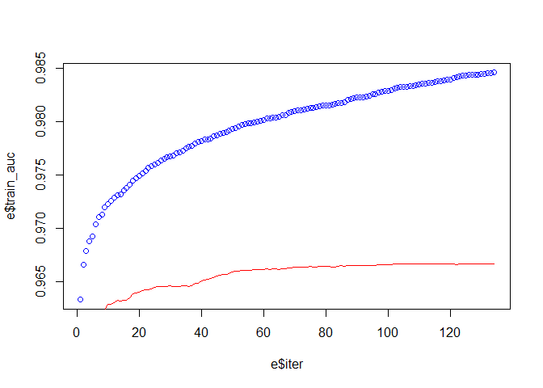
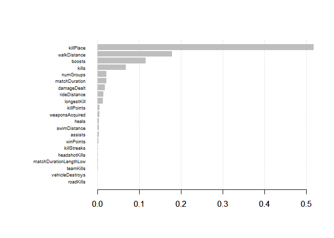
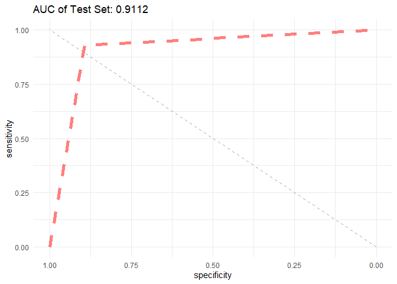

Extreme Gradient Boosting
================
Chance Robinson
12/03/2019

  - [Exploratory Data Analysis](#exploratory-data-analysis)
      - [Library Imports](#library-imports)
      - [Load the CSV Data](#load-the-csv-data)
      - [Remove Missing Values](#remove-missing-values)
      - [Specify Model Columns of
        Interest](#specify-model-columns-of-interest)
      - [Prepare Dataframe](#prepare-dataframe)
      - [XG Boost](#xg-boost)
      - [Train / Test Split](#train-test-split)
          - [Test](#test)
          - [Area Under the Curve](#area-under-the-curve)

# Exploratory Data Analysis

## Library Imports

``` r
library(tidyverse)
```

    ## -- Attaching packages -------------------------------------------------------------------------------------------------------- tidyverse 1.2.1 --

    ## v ggplot2 3.2.1     v purrr   0.3.3
    ## v tibble  2.1.3     v dplyr   0.8.3
    ## v tidyr   1.0.0     v stringr 1.4.0
    ## v readr   1.3.1     v forcats 0.4.0

    ## -- Conflicts ----------------------------------------------------------------------------------------------------------- tidyverse_conflicts() --
    ## x dplyr::filter() masks stats::filter()
    ## x dplyr::lag()    masks stats::lag()

``` r
# Gradient Boosing
library(xgboost)  
```

    ## 
    ## Attaching package: 'xgboost'

    ## The following object is masked from 'package:dplyr':
    ## 
    ##     slice

``` r
library(magrittr)
```

    ## 
    ## Attaching package: 'magrittr'

    ## The following object is masked from 'package:purrr':
    ## 
    ##     set_names

    ## The following object is masked from 'package:tidyr':
    ## 
    ##     extract

``` r
library(Matrix)
```

    ## 
    ## Attaching package: 'Matrix'

    ## The following objects are masked from 'package:tidyr':
    ## 
    ##     expand, pack, unpack

``` r
# downSample
library(caret)
```

    ## Loading required package: lattice

    ## 
    ## Attaching package: 'caret'

    ## The following object is masked from 'package:purrr':
    ## 
    ##     lift

``` r
# ROC Curves
library(ROCR)
```

    ## Loading required package: gplots

    ## 
    ## Attaching package: 'gplots'

    ## The following object is masked from 'package:stats':
    ## 
    ##     lowess

``` r
library(pROC)
```

    ## Type 'citation("pROC")' for a citation.

    ## 
    ## Attaching package: 'pROC'

    ## The following objects are masked from 'package:stats':
    ## 
    ##     cov, smooth, var

## Load the CSV Data

``` r
data <- read.csv("../../../data/pubg_solo_game_types.csv", stringsAsFactors=FALSE)
```

``` r
head(data)
```

    ##               Id        groupId        matchId assists boosts damageDealt DBNOs
    ## 1 269c3fc4a26935 3c07be51998e6f ce9bc89b3ca08c       0      1      100.00     0
    ## 2 73348483a5974b 1c8e486a643207 85601fe44d519b       0      0       17.81     0
    ## 3 caa1a36afeb7b2 c653cfca3b8b06 e5e181d2da0334       0      1      100.00     0
    ## 4 5fd62798396ca8 bb19a05801d30d 9e3c46f8acde82       0      0       36.00     0
    ## 5 18d002b46b1abc 00a3f236559532 eccc44618c0442       0      1      236.00     0
    ## 6 d08ce24e7a7973 d57ed9de010a4e 1eda9747e31f1f       0      0        0.00     0
    ##   headshotKills heals killPlace killPoints kills killStreaks longestKill
    ## 1             0     0        24          0     1           1      21.250
    ## 2             0     0        79       1274     0           0       0.000
    ## 3             0     0        38       1000     1           1       7.667
    ## 4             0     0        84          0     0           0       0.000
    ## 5             0     7         7       1142     3           1      11.720
    ## 6             0     0        65          0     0           0       0.000
    ##   matchDuration matchType maxPlace numGroups rankPoints revives rideDistance
    ## 1          1398      solo       92        89       1509       0          0.0
    ## 2          1945      solo       99        95         -1       0        129.3
    ## 3          2042      solo       90        86         -1       0          0.0
    ## 4          1999      solo       94        92       1507       0          0.0
    ## 5          1423      solo       94        88         -1       0          0.0
    ## 6          1471      solo       99        94       1500       0          0.0
    ##   roadKills swimDistance teamKills vehicleDestroys walkDistance weaponsAcquired
    ## 1         0           61         0               0       1528.0               3
    ## 2         0            0         0               0        471.9               3
    ## 3         0            0         0               0        231.7               4
    ## 4         0            0         0               0        292.6               1
    ## 5         0            0         0               0       1913.0               8
    ## 6         0            0         0               0        870.9               3
    ##   winPoints winPlacePerc top.10
    ## 1         0       0.8462      0
    ## 2      1536       0.2245      0
    ## 3      1500       0.1573      0
    ## 4         0       0.1075      0
    ## 5      1557       0.9355      1
    ## 6         0       0.3878      0

## Remove Missing Values

``` r
# remove the row with no winPlacePerc   
data <- data[!data$Id == 'f70c74418bb064',]


head(data)
```

    ##               Id        groupId        matchId assists boosts damageDealt DBNOs
    ## 1 269c3fc4a26935 3c07be51998e6f ce9bc89b3ca08c       0      1      100.00     0
    ## 2 73348483a5974b 1c8e486a643207 85601fe44d519b       0      0       17.81     0
    ## 3 caa1a36afeb7b2 c653cfca3b8b06 e5e181d2da0334       0      1      100.00     0
    ## 4 5fd62798396ca8 bb19a05801d30d 9e3c46f8acde82       0      0       36.00     0
    ## 5 18d002b46b1abc 00a3f236559532 eccc44618c0442       0      1      236.00     0
    ## 6 d08ce24e7a7973 d57ed9de010a4e 1eda9747e31f1f       0      0        0.00     0
    ##   headshotKills heals killPlace killPoints kills killStreaks longestKill
    ## 1             0     0        24          0     1           1      21.250
    ## 2             0     0        79       1274     0           0       0.000
    ## 3             0     0        38       1000     1           1       7.667
    ## 4             0     0        84          0     0           0       0.000
    ## 5             0     7         7       1142     3           1      11.720
    ## 6             0     0        65          0     0           0       0.000
    ##   matchDuration matchType maxPlace numGroups rankPoints revives rideDistance
    ## 1          1398      solo       92        89       1509       0          0.0
    ## 2          1945      solo       99        95         -1       0        129.3
    ## 3          2042      solo       90        86         -1       0          0.0
    ## 4          1999      solo       94        92       1507       0          0.0
    ## 5          1423      solo       94        88         -1       0          0.0
    ## 6          1471      solo       99        94       1500       0          0.0
    ##   roadKills swimDistance teamKills vehicleDestroys walkDistance weaponsAcquired
    ## 1         0           61         0               0       1528.0               3
    ## 2         0            0         0               0        471.9               3
    ## 3         0            0         0               0        231.7               4
    ## 4         0            0         0               0        292.6               1
    ## 5         0            0         0               0       1913.0               8
    ## 6         0            0         0               0        870.9               3
    ##   winPoints winPlacePerc top.10
    ## 1         0       0.8462      0
    ## 2      1536       0.2245      0
    ## 3      1500       0.1573      0
    ## 4         0       0.1075      0
    ## 5      1557       0.9355      1
    ## 6         0       0.3878      0

``` r
data <- data %>%
  mutate(winPoints = ifelse(rankPoints != -1 & winPoints == 0, -1, winPoints )) %>%
  mutate(winPoints = ifelse(rankPoints != -1 & killPoints == 0, -1, killPoints ))

# outliers <- data[   data$walkDistance > mean(data$walkDistance) + (sd(data$walkDistance) * 3), ]
```

## Specify Model Columns of Interest

``` r
cols_to_keep = c("walkDistance", "killPlace", "boosts", "weaponsAcquired", "damageDealt", "heals", "kills", "top.10")

cols_to_remove = c("Id", "groupId", "matchId", "matchType", "DBNOs", "revives", "rankPoints", "winPlacePerc",
                   "maxPlace")

head(data[cols_to_keep])
```

    ##   walkDistance killPlace boosts weaponsAcquired damageDealt heals kills top.10
    ## 1       1528.0        24      1               3      100.00     0     1      0
    ## 2        471.9        79      0               3       17.81     0     0      0
    ## 3        231.7        38      1               4      100.00     0     1      0
    ## 4        292.6        84      0               1       36.00     0     0      0
    ## 5       1913.0         7      1               8      236.00     7     3      1
    ## 6        870.9        65      0               3        0.00     0     0      0

## Prepare Dataframe

``` r
data.mod <- data %>%
  select(-cols_to_remove) %>%
  mutate(kills= kills * 100 / numGroups) %>% # Normalized Kills
  mutate(matchDurationLength = as.factor(ifelse(matchDuration < mean(matchDuration), "Low", "High"))) 

# data.mod$numGroups <- NULL

summary(data.mod)
```

    ##     assists            boosts        damageDealt      headshotKills    
    ##  Min.   :0.00000   Min.   : 0.000   Min.   :   0.00   Min.   : 0.0000  
    ##  1st Qu.:0.00000   1st Qu.: 0.000   1st Qu.:   0.00   1st Qu.: 0.0000  
    ##  Median :0.00000   Median : 0.000   Median :  65.73   Median : 0.0000  
    ##  Mean   :0.05562   Mean   : 1.066   Mean   : 112.62   Mean   : 0.2238  
    ##  3rd Qu.:0.00000   3rd Qu.: 2.000   3rd Qu.: 159.60   3rd Qu.: 0.0000  
    ##  Max.   :4.00000   Max.   :24.000   Max.   :2490.00   Max.   :19.0000  
    ##      heals          killPlace        killPoints         kills         
    ##  Min.   : 0.000   Min.   :  1.00   Min.   :   0.0   Min.   :  0.0000  
    ##  1st Qu.: 0.000   1st Qu.: 21.00   1st Qu.:   0.0   1st Qu.:  0.0000  
    ##  Median : 0.000   Median : 46.00   Median :   0.0   Median :  0.0000  
    ##  Mean   : 1.012   Mean   : 46.17   Mean   : 407.8   Mean   :  0.9649  
    ##  3rd Qu.: 1.000   3rd Qu.: 70.00   3rd Qu.:1032.0   3rd Qu.:  1.1236  
    ##  Max.   :49.000   Max.   :100.00   Max.   :1962.0   Max.   :100.0000  
    ##   killStreaks       longestKill      matchDuration    numGroups    
    ##  Min.   : 0.0000   Min.   :   0.00   Min.   : 950   Min.   : 1.00  
    ##  1st Qu.: 0.0000   1st Qu.:   0.00   1st Qu.:1431   1st Qu.:89.00  
    ##  Median : 0.0000   Median :   0.00   Median :1771   Median :92.00  
    ##  Mean   : 0.4429   Mean   :  20.70   Mean   :1676   Mean   :87.29  
    ##  3rd Qu.: 1.0000   3rd Qu.:  15.91   3rd Qu.:1903   3rd Qu.:94.00  
    ##  Max.   :18.0000   Max.   :1001.00   Max.   :2237   Max.   :99.00  
    ##   rideDistance        roadKills          swimDistance        teamKills      
    ##  Min.   :    0.00   Min.   : 0.000000   Min.   :   0.000   Min.   :0.00000  
    ##  1st Qu.:    0.00   1st Qu.: 0.000000   1st Qu.:   0.000   1st Qu.:0.00000  
    ##  Median :    0.00   Median : 0.000000   Median :   0.000   Median :0.00000  
    ##  Mean   :  640.98   Mean   : 0.009948   Mean   :   5.878   Mean   :0.01499  
    ##  3rd Qu.:    1.16   3rd Qu.: 0.000000   3rd Qu.:   0.000   3rd Qu.:0.00000  
    ##  Max.   :33970.00   Max.   :18.000000   Max.   :1606.000   Max.   :1.00000  
    ##  vehicleDestroys    walkDistance     weaponsAcquired    winPoints     
    ##  Min.   :0.00000   Min.   :    0.0   Min.   : 0.000   Min.   :  -1.0  
    ##  1st Qu.:0.00000   1st Qu.:  114.0   1st Qu.: 2.000   1st Qu.:  -1.0  
    ##  Median :0.00000   Median :  607.7   Median : 3.000   Median :  -1.0  
    ##  Mean   :0.00753   Mean   :  986.2   Mean   : 3.757   Mean   : 407.2  
    ##  3rd Qu.:0.00000   3rd Qu.: 1616.0   3rd Qu.: 5.000   3rd Qu.:1032.0  
    ##  Max.   :3.00000   Max.   :15370.0   Max.   :52.000   Max.   :1962.0  
    ##      top.10       matchDurationLength
    ##  Min.   :0.0000   High:93981         
    ##  1st Qu.:0.0000   Low :87962         
    ##  Median :0.0000                      
    ##  Mean   :0.1045                      
    ##  3rd Qu.:0.0000                      
    ##  Max.   :1.0000

``` r
table(data.mod$top.10)
```

    ## 
    ##      0      1 
    ## 162933  19010

## XG Boost

## Train / Test Split

``` r
set.seed(1234)

split.perc = .70

train.indices = sample(1:dim(data.mod)[1],round(split.perc * dim(data.mod)[1]))

train = data.mod[train.indices,]
test = data.mod[-train.indices,]

train <- downSample(train, as.factor(train$top.10), list = FALSE)
train$Class <- NULL
```

``` r
# ?xgb.DMatrix

trainm <- sparse.model.matrix(top.10 ~ ., data = train, na.action='na.pass')
train_label <- train[, "top.10"]
train_matrix <- xgb.DMatrix(data = as.matrix(trainm), label = train_label, missing = -1)

testm <- sparse.model.matrix(top.10 ~ ., data = test)
test_label <- test[, "top.10"]
test_matrix <- xgb.DMatrix(data = as.matrix(testm), label = test_label, missing = -1)
```

``` r
nc <- length(unique(train_label))


xgb_params <- list("objective" = "binary:logistic",
                  "eval_metric" = "auc")

watchlist <- list(train = train_matrix, test = test_matrix)
```

``` r
?xgb.train
```

    ## starting httpd help server ... done

``` r
bst_model <- xgb.train(params = xgb_params,
                       data = train_matrix,
                       nrounds = 134,
                       watchlist = watchlist,
                       scale_pos_weight = 0.7,
                       eta = 0.07,
                       max.depth = 10,
                       gamma = 5,
                       colsample_bytree = .9,
                       subsample = 0.8,
                       missing = -1,
                       min_child_weight = 1,
                       seed = 1234
                       )
```

    ## [1]  train-auc:0.963299  test-auc:0.953866 
    ## [2]  train-auc:0.966598  test-auc:0.956796 
    ## [3]  train-auc:0.967885  test-auc:0.958278 
    ## [4]  train-auc:0.968754  test-auc:0.959216 
    ## [5]  train-auc:0.969214  test-auc:0.959043 
    ## [6]  train-auc:0.970412  test-auc:0.960442 
    ## [7]  train-auc:0.971081  test-auc:0.961726 
    ## [8]  train-auc:0.971263  test-auc:0.961853 
    ## [9]  train-auc:0.971948  test-auc:0.962323 
    ## [10] train-auc:0.972281  test-auc:0.962843 
    ## [11] train-auc:0.972581  test-auc:0.962902 
    ## [12] train-auc:0.972851  test-auc:0.963033 
    ## [13] train-auc:0.973085  test-auc:0.963281 
    ## [14] train-auc:0.973163  test-auc:0.963202 
    ## [15] train-auc:0.973590  test-auc:0.963284 
    ## [16] train-auc:0.973804  test-auc:0.963250 
    ## [17] train-auc:0.974099  test-auc:0.963509 
    ## [18] train-auc:0.974513  test-auc:0.963827 
    ## [19] train-auc:0.974723  test-auc:0.963914 
    ## [20] train-auc:0.974954  test-auc:0.963988 
    ## [21] train-auc:0.975177  test-auc:0.964132 
    ## [22] train-auc:0.975387  test-auc:0.964262 
    ## [23] train-auc:0.975699  test-auc:0.964249 
    ## [24] train-auc:0.975845  test-auc:0.964311 
    ## [25] train-auc:0.975982  test-auc:0.964473 
    ## [26] train-auc:0.976129  test-auc:0.964535 
    ## [27] train-auc:0.976347  test-auc:0.964556 
    ## [28] train-auc:0.976558  test-auc:0.964562 
    ## [29] train-auc:0.976686  test-auc:0.964570 
    ## [30] train-auc:0.976760  test-auc:0.964585 
    ## [31] train-auc:0.976868  test-auc:0.964575 
    ## [32] train-auc:0.977034  test-auc:0.964571 
    ## [33] train-auc:0.977136  test-auc:0.964541 
    ## [34] train-auc:0.977276  test-auc:0.964585 
    ## [35] train-auc:0.977482  test-auc:0.964631 
    ## [36] train-auc:0.977650  test-auc:0.964552 
    ## [37] train-auc:0.977728  test-auc:0.964579 
    ## [38] train-auc:0.977962  test-auc:0.964811 
    ## [39] train-auc:0.978107  test-auc:0.964880 
    ## [40] train-auc:0.978198  test-auc:0.965040 
    ## [41] train-auc:0.978325  test-auc:0.965168 
    ## [42] train-auc:0.978367  test-auc:0.965255 
    ## [43] train-auc:0.978462  test-auc:0.965317 
    ## [44] train-auc:0.978655  test-auc:0.965408 
    ## [45] train-auc:0.978743  test-auc:0.965501 
    ## [46] train-auc:0.978906  test-auc:0.965588 
    ## [47] train-auc:0.978989  test-auc:0.965666 
    ## [48] train-auc:0.979062  test-auc:0.965713 
    ## [49] train-auc:0.979220  test-auc:0.965787 
    ## [50] train-auc:0.979326  test-auc:0.965928 
    ## [51] train-auc:0.979385  test-auc:0.965946 
    ## [52] train-auc:0.979579  test-auc:0.966001 
    ## [53] train-auc:0.979735  test-auc:0.966045 
    ## [54] train-auc:0.979804  test-auc:0.966074 
    ## [55] train-auc:0.979856  test-auc:0.966076 
    ## [56] train-auc:0.979909  test-auc:0.966086 
    ## [57] train-auc:0.979943  test-auc:0.966105 
    ## [58] train-auc:0.980006  test-auc:0.966108 
    ## [59] train-auc:0.980087  test-auc:0.966116 
    ## [60] train-auc:0.980170  test-auc:0.966150 
    ## [61] train-auc:0.980324  test-auc:0.966173 
    ## [62] train-auc:0.980342  test-auc:0.966168 
    ## [63] train-auc:0.980378  test-auc:0.966181 
    ## [64] train-auc:0.980419  test-auc:0.966172 
    ## [65] train-auc:0.980473  test-auc:0.966162 
    ## [66] train-auc:0.980594  test-auc:0.966185 
    ## [67] train-auc:0.980648  test-auc:0.966188 
    ## [68] train-auc:0.980838  test-auc:0.966259 
    ## [69] train-auc:0.980930  test-auc:0.966277 
    ## [70] train-auc:0.981033  test-auc:0.966342 
    ## [71] train-auc:0.981081  test-auc:0.966380 
    ## [72] train-auc:0.981115  test-auc:0.966384 
    ## [73] train-auc:0.981197  test-auc:0.966392 
    ## [74] train-auc:0.981233  test-auc:0.966396 
    ## [75] train-auc:0.981303  test-auc:0.966402 
    ## [76] train-auc:0.981350  test-auc:0.966381 
    ## [77] train-auc:0.981384  test-auc:0.966398 
    ## [78] train-auc:0.981469  test-auc:0.966412 
    ## [79] train-auc:0.981526  test-auc:0.966419 
    ## [80] train-auc:0.981542  test-auc:0.966416 
    ## [81] train-auc:0.981552  test-auc:0.966411 
    ## [82] train-auc:0.981600  test-auc:0.966394 
    ## [83] train-auc:0.981662  test-auc:0.966389 
    ## [84] train-auc:0.981747  test-auc:0.966440 
    ## [85] train-auc:0.981802  test-auc:0.966478 
    ## [86] train-auc:0.981859  test-auc:0.966461 
    ## [87] train-auc:0.982044  test-auc:0.966500 
    ## [88] train-auc:0.982150  test-auc:0.966514 
    ## [89] train-auc:0.982212  test-auc:0.966537 
    ## [90] train-auc:0.982272  test-auc:0.966550 
    ## [91] train-auc:0.982306  test-auc:0.966543 
    ## [92] train-auc:0.982337  test-auc:0.966543 
    ## [93] train-auc:0.982355  test-auc:0.966545 
    ## [94] train-auc:0.982424  test-auc:0.966535 
    ## [95] train-auc:0.982574  test-auc:0.966548 
    ## [96] train-auc:0.982620  test-auc:0.966546 
    ## [97] train-auc:0.982724  test-auc:0.966558 
    ## [98] train-auc:0.982825  test-auc:0.966591 
    ## [99] train-auc:0.982895  test-auc:0.966594 
    ## [100]    train-auc:0.982924  test-auc:0.966606 
    ## [101]    train-auc:0.982990  test-auc:0.966615 
    ## [102]    train-auc:0.983112  test-auc:0.966660 
    ## [103]    train-auc:0.983206  test-auc:0.966661 
    ## [104]    train-auc:0.983264  test-auc:0.966656 
    ## [105]    train-auc:0.983278  test-auc:0.966661 
    ## [106]    train-auc:0.983324  test-auc:0.966650 
    ## [107]    train-auc:0.983336  test-auc:0.966653 
    ## [108]    train-auc:0.983380  test-auc:0.966659 
    ## [109]    train-auc:0.983460  test-auc:0.966652 
    ## [110]    train-auc:0.983548  test-auc:0.966640 
    ## [111]    train-auc:0.983559  test-auc:0.966667 
    ## [112]    train-auc:0.983575  test-auc:0.966666 
    ## [113]    train-auc:0.983655  test-auc:0.966660 
    ## [114]    train-auc:0.983683  test-auc:0.966643 
    ## [115]    train-auc:0.983740  test-auc:0.966673 
    ## [116]    train-auc:0.983809  test-auc:0.966649 
    ## [117]    train-auc:0.983818  test-auc:0.966653 
    ## [118]    train-auc:0.983888  test-auc:0.966640 
    ## [119]    train-auc:0.983970  test-auc:0.966631 
    ## [120]    train-auc:0.984008  test-auc:0.966627 
    ## [121]    train-auc:0.984131  test-auc:0.966628 
    ## [122]    train-auc:0.984218  test-auc:0.966621 
    ## [123]    train-auc:0.984294  test-auc:0.966657 
    ## [124]    train-auc:0.984349  test-auc:0.966656 
    ## [125]    train-auc:0.984382  test-auc:0.966663 
    ## [126]    train-auc:0.984404  test-auc:0.966658 
    ## [127]    train-auc:0.984425  test-auc:0.966667 
    ## [128]    train-auc:0.984425  test-auc:0.966667 
    ## [129]    train-auc:0.984432  test-auc:0.966669 
    ## [130]    train-auc:0.984518  test-auc:0.966671 
    ## [131]    train-auc:0.984521  test-auc:0.966673 
    ## [132]    train-auc:0.984549  test-auc:0.966671 
    ## [133]    train-auc:0.984598  test-auc:0.966664 
    ## [134]    train-auc:0.984619  test-auc:0.966668

``` r
# print(bst_model)


prd <- predict(bst_model, test_matrix)

head(prd)
```

    ## [1] 0.0005110455 0.8080962300 0.6487966776 0.0184427071 0.0050845360
    ## [6] 0.5692574978

``` r
e <- data.frame(bst_model$evaluation_log)

head(e)
```

    ##   iter train_auc test_auc
    ## 1    1  0.963299 0.953866
    ## 2    2  0.966598 0.956796
    ## 3    3  0.967885 0.958278
    ## 4    4  0.968754 0.959216
    ## 5    5  0.969214 0.959043
    ## 6    6  0.970412 0.960442

``` r
plot(e$iter, e$train_auc, col = "blue")
lines(e$iter, e$test_auc, col = "red")
```

<!-- -->

``` r
max(e$test_auc)
```

    ## [1] 0.966673

``` r
e[e$test_auc ==  0.966413, ]
```

    ## [1] iter      train_auc test_auc 
    ## <0 rows> (or 0-length row.names)

``` r
# # Feature importance
imp <- xgb.importance(colnames(train_matrix), model = bst_model)

# print(imp)

xgb.plot.importance(imp)
```

<!-- -->

``` r
p <- predict(bst_model, newdata = test_matrix)
# head(p)
```

### Test

``` r
p <- as.factor(ifelse(p > 0.5, "1", "0"))

head(p)
```

    ## [1] 0 1 1 0 0 1
    ## Levels: 0 1

``` r
confusionMatrix(data=as.factor(p),  
                reference=as.factor(test_label), "1")
```

    ## Confusion Matrix and Statistics
    ## 
    ##           Reference
    ## Prediction     0     1
    ##          0 43687   402
    ##          1  5222  5272
    ##                                           
    ##                Accuracy : 0.897           
    ##                  95% CI : (0.8944, 0.8995)
    ##     No Information Rate : 0.896           
    ##     P-Value [Acc > NIR] : 0.2441          
    ##                                           
    ##                   Kappa : 0.5979          
    ##                                           
    ##  Mcnemar's Test P-Value : <2e-16          
    ##                                           
    ##             Sensitivity : 0.92915         
    ##             Specificity : 0.89323         
    ##          Pos Pred Value : 0.50238         
    ##          Neg Pred Value : 0.99088         
    ##              Prevalence : 0.10395         
    ##          Detection Rate : 0.09659         
    ##    Detection Prevalence : 0.19226         
    ##       Balanced Accuracy : 0.91119         
    ##                                           
    ##        'Positive' Class : 1               
    ## 

### Area Under the Curve

``` r
# ?pROC

auc <- roc(as.integer(test_label), as.integer(p))
```

    ## Setting levels: control = 0, case = 1

    ## Setting direction: controls < cases

``` r
# print(auc)

# plot(auc, ylim=c(0,1), print.thres=TRUE, main=paste('AUC of Test Set:', round(auc$auc[[1]],2)))
# abline(h=1,col='green',lwd=2)
# abline(h=0,col='red',lwd=2)

g <- ggroc(auc, alpha = 0.5, colour = "red", linetype = 2, size = 2) +
  theme_minimal() + 
  ggtitle(paste('AUC of Test Set:', round(auc$auc[[1]],4))) + 
  geom_segment(aes(x = 0, xend = 1, y = 0, yend = 1), color="darkgrey", linetype="dashed")
  

plot(g)
```

<!-- -->

``` r
# train <- read.csv("../../../data/pubg_solo_game_types_train_downsampled.csv", stringsAsFactors=FALSE)
# 
# test <- read.csv("../../../data/pubg_solo_game_types_test_full.csv", stringsAsFactors=FALSE)
# 
# 
# train <- train %>%
#   select(-cols_to_remove) %>%
#   mutate(top.10 = factor(top.10, labels = c("No", "Yes")))
# 
# 
# test <- test %>%
#   select(-cols_to_remove) %>%
#   mutate(top.10 = factor(top.10, labels = c("No", "Yes")))
# 
# 
# model.rf.train <- randomForest(as.factor(top.10) ~ ., data = train, ntree = 275, mtry = 8, cutoff = c(0.36,1-0.36))
# 
# print(model.rf.train)
# 
# 
# p1 <- predict(model.rf.train, train)
# p2 <- predict(model.rf.train, test)
# 
# 
# print(model.rf.train)
# plot(model.rf.train)
# varImp(model.rf.train)
# 
# 
# confusionMatrix(data=p1,
#                 reference=train$top.10, "Yes")
# 
# 
# confusionMatrix(data=p2,
#                 reference=test$top.10, "Yes")
```
